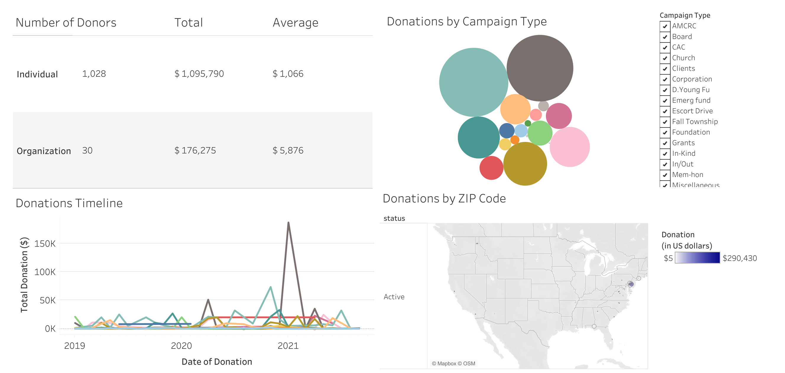
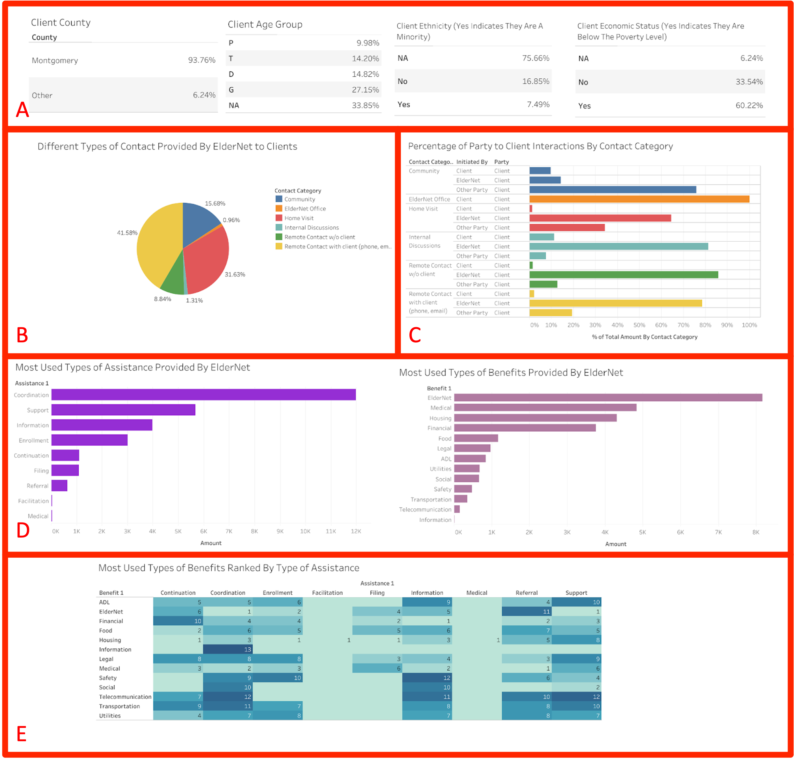
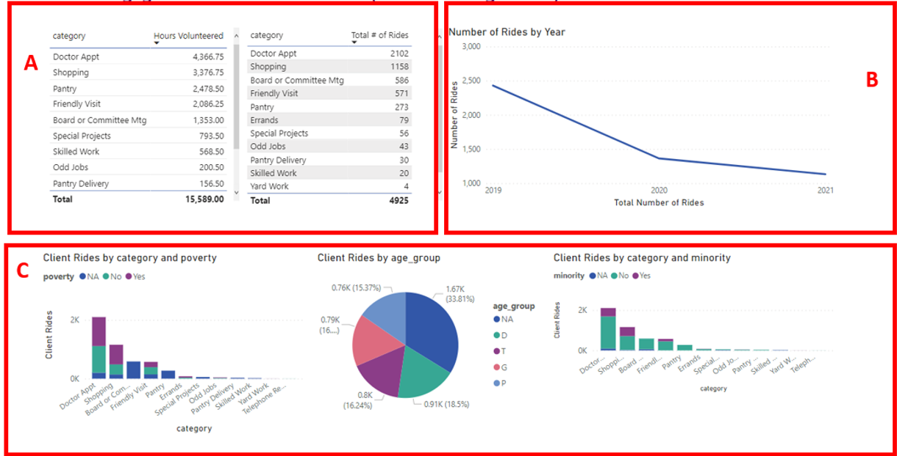
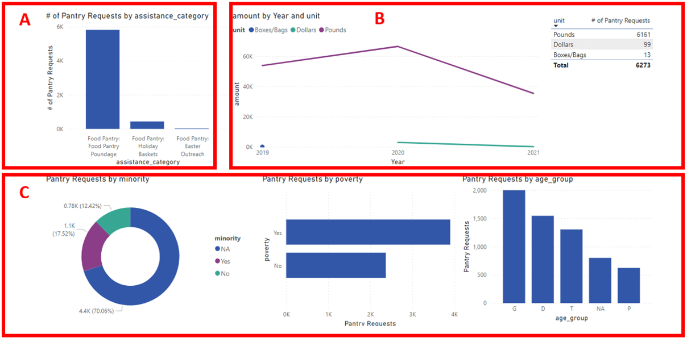

```{r setup, include=FALSE}
knitr::opts_chunk$set(echo = TRUE,
                      out.width = "75%",
                      fig.align = "center")
```

## Executive Summary

As a non-profit organization providing vital services and assistance to the elderly, ElderNet needs to make strategic decisions often spanning multiple layers of operation. We sought to create a series of interactive dashboards that would help inform Eldernet’s decision-making pipeline and serve as a storytelling tool. Our dashboards were built in Power BI and Tableau, both platforms chosen to ensure Eldernet could recreate and maintain these visualizations with relative ease and minimal effort, whether it is in a public-facing website or as part of their internal documentation.

## Contributors

**Paromita Barua, MS** is a Technology consultant at IQVIA who also completed her Masters in Business Analytics with a minor in Applied Data Science at Drexel University in 2021. She enjoys hands-on data analysis and is interested in expanding her skills in data science and R/Python programming.

**Sean Cancino, MS** is an aspiring data scientist who completed a Masters in Statistics at the University of Delaware in 2021. He also received a Bachelors in Neuroscience from the University of Delaware in 2015. He is currently interested in learning new data science methods and data engineering techniques. In his free time, he enjoys running, hiking, exploring new events and trying out new restaurants in the city.

**Michelle Chiu, MA** is a PhD Candidate in Psychology at Temple University studying the potential impact of digital media engagement in cognition and behavior. She also works as a statistics consultant for Temple's Executive Doctorate in Business Administration program. When she’s not tackling and visualizing data using R, you can find her exploring Philly’s food scene or practicing yoga.

**Cynthia Cho, MBA** currently has an MBA in Data Project Management from Keller Graduate School of Management. She graduated in May 2013. She was a former Data Elements Planner at IQVIA and is currently pursuing a Machine Learning Certification from Open Data Science Conference. She enjoys hands-on data analysis in SQLite and is expanding her skills in Data Science and Python programming.

## Problem definition and dataset

Prior to the analysis, the team had joined together data tables provided by ElderNet from the Github repository provided and joined the related data in Python into a single dataset. Our team  examined many factors and variables from many key areas which influence Eldernet client satisfaction and Eldernet's strength. Among these are in the area of Financial Assistance, Care Management, and User Engagement. While we researched these key factors for which we also analyzed the data and created visualization dashboards which illustrated these ideas.

### Data Challenges

- Missing (NA) values across multiple variables of interest, including donor zip codes and client demographics.
- Little to no overlap in identifier variables between data sets.Moreover, the donations data set could not be merged to any of the other data sets provided.

Our team included the NA values when describing client demographics (e.g. socioeconomic status, minority) since it was not clear whether these data were missing at random or due to clients choosing to not respond.
 
We created three dashboards to provide a comprehensive overview of the data for ElderNet.

## Results

### Dashboard 1. Financials

We sought to provide a dashboard (interactive link [here](https://public.tableau.com/app/profile/michelle.chiu/viz/Charity_Dashboard_16486536967300/Dashboard1?publish=yes)) that would allow ElderNet to both visualize their overall financial status across four facets of the donations data, as well as flexibly draw comparisons that might help maximize funding and campaign efforts.The dataset used in this analysis was _donations_anonymized.csv_. 

```{r, echo = FALSE, message=FALSE, fig.cap='ElderNet donations across all campaign types between January 2019 and September 2021.'}

```
Figure 1 illustrates donations from across all 20 campaign types. Users can select single or multiple Campaign Types via check box or keyword search. As you'll see in the example below, donations data can be adjusted across all four panels according to the Campaign Type/s selected.

<p>

</p>

The image above shows donations specifically from **Fall Township** and **Spring Event** campaigns.

- Panel A shows that a majority of overall donations came from Individuals, rather than Organizations. 
- Panel B shows that patrons donated relatively similar amounts to both campaigns. 
- Panel C suggests an overall upward trend in donations between late 2019 to 2021, with donations peaking seasonally in a way that corresponded to their respective campaigns (e.g. peak donations for Fall Township occurred in what is considered Fall/Autumn in the continental US). 
- Finally, Panel D provides a map highlighting the areas corresponding to donor zip codes – in this case, we see that most of the donors came from the surrounding area of Philadelphia, though some donors also came from non-East Coast regions. 
- Users can also interact with specific panels; for example, in Panel D, users can zoom in on the East Coast region and see how donations varied in the surrounding Philadelphia area. 
- Lastly, users can hover their mouse over specific parts of each panel to see their respective data (e.g. hovering over one of the bubbles in Panel B would display the corresponding campaign type and amount donated.
\newpage

### Dashboard 2. Care Management

The Care Management dashboard (linked [here](https://public.tableau.com/app/profile/sean.cancino/viz/Charity_Demographics_Care_Management/Dashboard1?publish=yes)) displays how clients have been interacting with ElderNet, as well as the types of assistance and benefits that they request from ElderNet.

```{r, echo = FALSE, message=FALSE, fig.cap='Client interactions with ElderNet between 2019 and 2021.'}

```

- Panel A shows the types of contact ElderNet has had with their clients as percentages of all contact ElderNet has had with their clients. ElderNet has around 50% remote contact with their clients, and also has around 33% contact as in person home visits with their clients.
- Panel B shows the percentage of contact ElderNet, other parties, and other clients have with ElderNet’s clients for every contact type. ElderNet interacts with their clients the most compared to other parties in the contact categories “Home Visit”, “Internal Discussions”, and “Remote Contact With and Without Client”. Other parties communicate with clients the most in the contact category “Community”.
- Panel C shows the types of assistance and benefits of clients that are the most inquired about and used when they contact ElderNet. Coordination, support, information, and enrollment seem to be the most used types of assistance that ElderNet provides to clients. Other than ElderNet, medical, housing, food, and legal benefits seem to be the most used types of benefits that ElderNet provides to clients.
- Panel D shows the benefits that clients inquire about the most relative to the type of assistance provided by ElderNet. The most used benefits are ranked by each type of assistance. In order to interpret this table, pick an assistance category such as enrollment. To see the ranking of the most used benefits with respect to enrollment assistance type, find the enrollment column in the table. The numbers under that column indicate the ranking of the most used benefits with respect to Enrollment. The most used types of benefits with respect to enrollment are housing, ElderNet, legal, and financial.

### Dashboard 3. Client Engagement

Our goal was to visualize how clients utilize the services offered by ElderNet. The 3 datasets used in this analysis were:  _client_info_anonymized.csv_, _volunteer_services_anonymized.csv_, and _pantry_anonymized.csv_.

```{r, echo = FALSE, message=FALSE, fig.cap='Volunteer services (rides involvingn clients) betwene January 2019 and September 2021,'}

```

The dashboard above contains data for volunteer services, particularly rider services collected from January 2019 to September 2021.

- Panel A highlights categories which had the highest total hours volunteered and total number of rides provided.
- Panel B provides an overview of how the number of rides changed from 2019 to 2021.
- Panel C displays how different categories tie in with client demographics. For example, we can deduce from the Client Rides by age_group visual that the highest number of rides were taken by age group D.
\newpage



The dashboard above (linked [here](https://public.tableau.com/app/profile/sean.cancino/viz/ClientEngagementDashboards/Dashboard2?publish=yes)) contains data for Pantry utilization collected from January 2019 to September 2021. 

- Panel A highlights assistance category with highest number of pantry requests.
- Panel B provides an overview of how much food, boxes/bags and dollars changed from 2019 to 2021.
- Panel C displays how pantry requests look across different client demographics. For example, pantry services are used mostly by impoverished and minority clients. Additionally age group G clients are more likely to seek pantry services.

Overall, we believe that the client management dashboard can be leveraged to understand which services are most valuable to a given client based on certain demographic trends.

## Next Steps

Should ElderNet want to create these visualizations in either Tableau or PowerBI, they can review cost, pros and cons for each platform below.

### Tableau

*Cost*

- $74 per user/month for [Desktop and Tableau Prep Builder](https://www.techsoup.org/products/tableau-desktop-and-tableau-prep-builder-g-49474-)
- [License donations for nonprofits](https://www.tableau.com/foundation/license-donations)

*Pros*

- Easy UI to learn and create visualizations
- Can handle large data using the cloud environment
- Effective data visualization tool for Mac and mobile audiences

*Cons*

- Less flexibility for tracking/managing diff versions 
- Slightly difficult to import custom visualization
- Embedding reports requires Tableau Public
 
### Power BI

*Cost*

- $3 per user/month for Power BI Pro
- [Nonprofits options with training & support](https://nonprofit.microsoft.com/en-us/getting-started)

*Pros*

- Can integrate with Microsoft cloud platforms and other platforms
- Provides tools such as Power Query for ETL processing
- Is capable of embedding reports; step-by-step guide linked [here](https://spreadsheeto.com/embed-power-bi/)

*Cons*

- Not user-friendly for Mac users
- UI is not that intuitive compared to other visualization tools
- Importing large data sets (greater than 1 GB) not possible with Pro version
