Exploring ElderNet Datasets
================

### Client Info

main takeaways:

-   There are 284 Client IDs are duplicated in the Client_info dataset.
    Example: anon_ID = `625` has 3 values for `age_group`, `T`, `D` and
    `missing`
-   There is lots of missing demographic data for poverty status,
    minority status and age group

``` r
# client_info %>% 
#   add_table()
```

``` r
duplicated <- 
  client_info %>%
  group_by(anon_ID) %>%
  tally(sort = TRUE) %>%
  filter(n > 1) 

# duplicated %>% 
#   add_table()
```

``` r
client_info %>%
  group_by(poverty, minority, age_group) %>% 
  tally() %>%
  mutate(label = paste('poverty:', poverty),
         age_group = ifelse(is.na(age_group), 'missing', age_group),
         minority = ifelse(is.na(minority), 'missing', minority)) %>%
  ggplot(., aes(x = age_group, y = n, fill = minority)) + 
  geom_col() + 
  facet_wrap(vars(label)) + 
  bg_theme() + 
  scale_fill_npg() + 
  labs(title =" ElderNet Clients by Age Group, Poverty Level and Mintory Status")
```

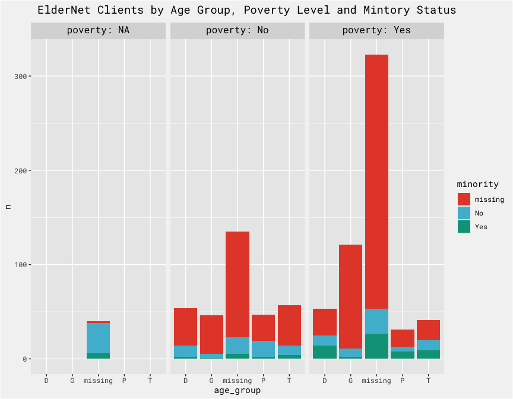<!-- -->

### Care Management

``` r
# care_mgmt %>% add_table()
```

Care management encounters per client is right-skewed. The max is 371
encounters, min is 1 and the median number of care management encounters
per client is 6.

``` r
# care_mgmt %>%
#   group_by(anon_ID) %>%
#   tally(sort = TRUE)  %>%
#   add_table()
```

``` r
quantiles <- 
  quantile(care_mgmt %>% group_by(anon_ID) %>% tally() %>% pull(n), probs = seq(0, 1, .10))

quantiles
```

    ##    0%   10%   20%   30%   40%   50%   60%   70%   80%   90%  100% 
    ##   1.0   1.0   1.8   2.0   4.0   6.0  10.0  15.0  26.2  77.9 371.0

``` r
care_mgmt %>%
  group_by(anon_ID) %>%
  tally() %>% 
  ggplot(aes(x = n)) +
  geom_histogram(fill = bg_green, alpha = .75, bins = 50)+ 
  bg_theme() + 
  labs(title = "distribution of care management encounters") 
```

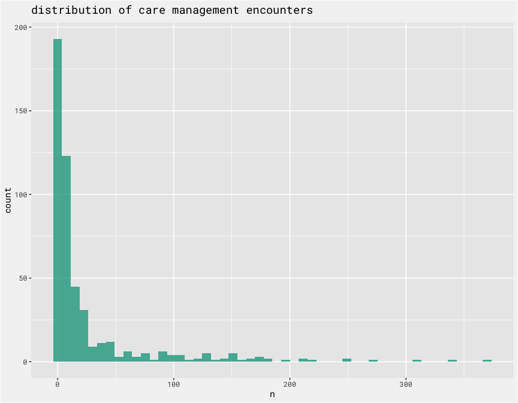<!-- -->

``` r
care_mgmt %>%
  mutate(month = floor_date(assistance_date, 'month')) %>%
  group_by(anon_ID, month) %>%
  tally() %>% 
  ggplot(aes(x = month, y = n, group = month)) +
  geom_jitter(color = 'gray', alpha = .55) + 
  geom_boxplot(fill = bg_green, alpha = .75, outlier.alpha = 0) + 
  labs(title = "distribution of care management encounters per month") + 
  bg_theme() + 
  scale_fill_npg() 
```

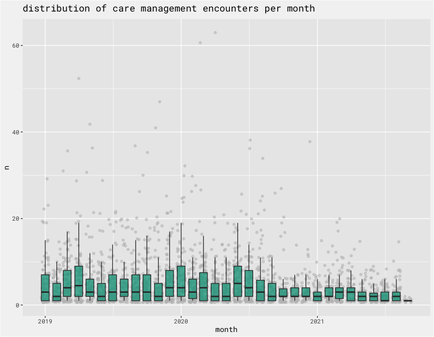<!-- -->

There is a decrease present in both `Community` and `Home Visit`
encounters starting in March 2020. It also appears remote contacts with
clients was shifted to more remote contacts without clients once the
pandemic hit.

``` r
care_mgmt %>%
  mutate(month = floor_date(assistance_date, 'month')) %>%
  group_by(assistance_category, month) %>%
  tally() %>% 
  padr::pad(group = "assistance_category") %>%
  padr::fill_by_value(n, 0) %>%
  ggplot(aes(x = month, y = n, color = assistance_category)) +
  geom_point() + 
  geom_line()+ 
  bg_theme() + 
  theme(legend.position = 'bottom') + 
  labs(color = NULL) +
  scale_color_npg()  + 
  labs(title = "monthly total care management encounters by type of service provided")
```

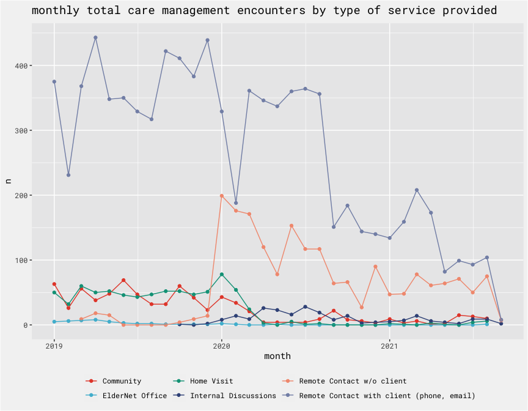<!-- -->

The average time spent per encounter varies from month to month.

``` r
care_mgmt %>%
  mutate(month = floor_date(assistance_date, 'month')) %>%
  group_by(month, assistance_category) %>%
  summarise(mean_time_spent = mean(amount)) %>%
  padr::pad(group = "assistance_category") %>%
  padr::fill_by_value(mean_time_spent, 0) %>%
  ggplot(aes(x = month, y = mean_time_spent, color = assistance_category)) +
  geom_point(show.legend = FALSE) + 
  geom_line(show.legend = FALSE) + 
  facet_wrap(vars(assistance_category), scales = 'free') + 
  bg_theme() + 
  scale_color_npg()  + 
  labs(title = "mean time spent per encounter type per month")
```

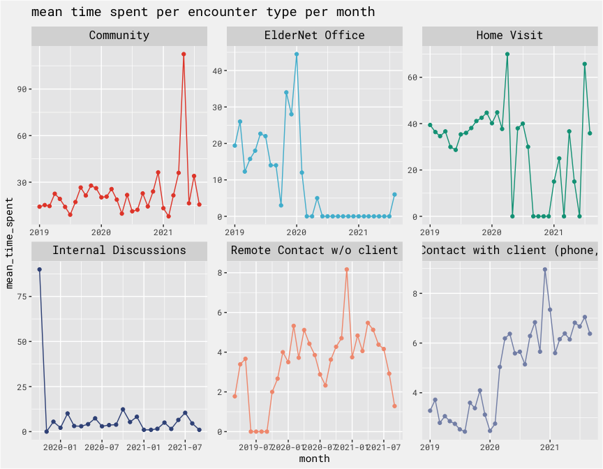<!-- -->

### Pantry

``` r
# pantry %>% add_table()
```

There is some repeating cycles present, likely due to holiday baskes
(see next chart).

``` r
pantry %>%
  mutate(assistance_date = mdy_hm(assistance_date),
         month = floor_date(assistance_date, 'month')) %>%
  group_by(month) %>%
  summarise(total = sum(amount)) %>%
  padr::pad() %>%
  padr::fill_by_value(n, 0) %>%
  ggplot(aes(x = month, y = total)) +
  geom_line(color = bg_green) + 
  geom_point(color = bg_green) + 
  bg_theme() +
  scale_color_npg() +
  labs(title = "total monthly pantry poundage")
```

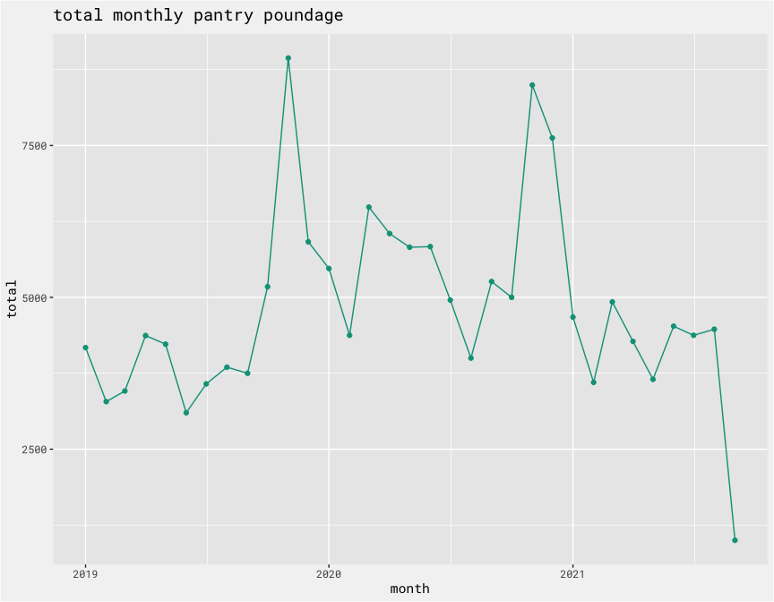<!-- -->

``` r
pantry %>%
  mutate(assistance_date = mdy_hm(assistance_date),
         month = floor_date(assistance_date, 'month')) %>%
  group_by(month, assistance_category) %>%
  tally() %>% 
  padr::pad(group = "assistance_category") %>%
  padr::fill_by_value(n, 0) %>%
  ggplot(aes(x = month, y = n, color = assistance_category)) +
  geom_line() + 
  geom_point()+ 
  bg_theme() +
  scale_color_npg() +
  labs(title = "Pantry poundage by category")
```

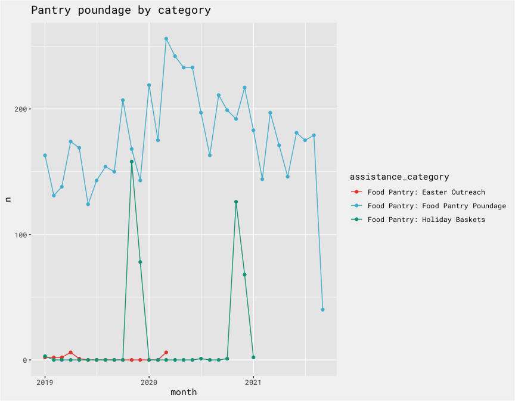<!-- -->

### Volunteers

``` r
# volunteer %>% add_table()
```

``` r
volunteer %>%
  mutate(appt_date = mdy(appt_date),
         month = floor_date(appt_date, 'month')) %>%
  group_by(month, category) %>% 
  summarise(mean_duration = mean(appt_duration)) %>%
  padr::pad(group = "category") %>%
  padr::fill_by_value(mean_duration, 0) %>%
  ggplot(., aes(x = month, y = mean_duration, color = category)) +
  geom_line(show.legend = FALSE) + 
  geom_point(show.legend = FALSE) + 
  facet_wrap(vars(category), scales = 'free') +
  labs(title = "monthly volunteer duration by category")+ 
  bg_theme() +
  scale_color_npg() 
```

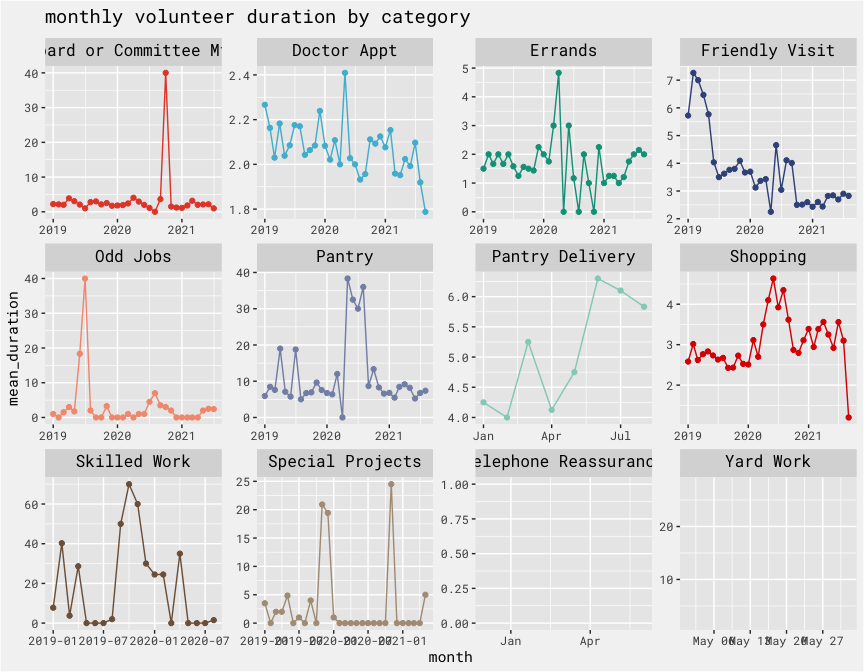<!-- -->

## Ideas

client story: \* filterable UI w/ summary of: \* number of recent
interactions \* time spent \* pantry items \* services utilized \* all
absolute and relative to other active clients \* can track over time…

utilization metric: \* time in month + food + care coordination… \*
track over time to see if more care is needed if metric starts to
decline?

Frame ldernet benefits in terms of the alternative

-   ElderNet is the dignified alternative - providing access to care and
    food keeps people in their homes longer
-   ElderNet is the preferred alternative - providing access to care and
    food allows clients to remain in the home longer
-   ElderNet is the less expensive alternative - providing access to
    care keeps up clients health and can help prevent costly care due to
    delays in care
-   ElderNet is the alternative

``` r
client <- 
  "210"

care_mgmt_story <- 
  care_mgmt %>%
  # filter(anon_ID == client) %>%
  mutate(month = as.Date(floor_date(assistance_date, 'month'))) %>%
  group_by(anon_ID, month) %>%
  summarise(total_care_mgmt_encounters = n(),
            total_care_mgmt_mins = sum(amount, na.rm = T),
            mean_care_mgmt_mins = mean(amount, na.rm = T))

pantry_story <- 
  pantry %>%
  # filter(anon_ID == client) %>%
  mutate(month = as.Date(floor_date(mdy_hm(assistance_date), 'month'))) %>%
  group_by(anon_ID, month) %>%
  summarise(total_pantry_encounters = n(),
            total_pantry_pounds = sum(amount, na.rm = T),
            mean_pantry_pounds = mean(amount, na.rm = T))

volunteer_story <- 
  volunteer %>%
  # filter(anon_ID == client) %>%
  mutate(month = as.Date(floor_date(mdy(appt_date), 'month'))) %>%
  group_by(anon_ID, month) %>%
  summarise(total_volunteer_encounters = n(),
            total_volunteer_mins = sum(appt_duration, na.rm = T),
            mean_volunteer_mins = mean(appt_duration, na.rm = T))

get_utilziation <- 
  function(client){
    
    client_info %>%
      filter(anon_ID == {{client}}) %>%
      left_join(., care_mgmt_story) %>%
      left_join(., pantry_story) %>%
      left_join(., volunteer_story) %>% 
      group_by(month) %>%
      summarise(encounters = sum(total_care_mgmt_encounters, total_pantry_encounters, total_volunteer_encounters, na.rm = T),
                mins = sum(total_care_mgmt_mins, mean_volunteer_mins, na.rm = T),
                food = total_pantry_pounds) %>% 
      mutate(monthly_total = sum(encounters, mins, food, na.rm = T))

  }

# total <- 
#   map_dfr(unique(client_info$anon_ID), ~get_utilziation(client = .x))

client_totals <-
  client_info %>%
  select(anon_ID) %>%
  left_join(., care_mgmt_story, by = c("anon_ID")) %>%
  left_join(., pantry_story, by = c("anon_ID", "month")) %>%
  left_join(., volunteer_story, by = c("anon_ID", "month")) 

client_totals %>%
  select(anon_ID, month, starts_with("mean")) %>%
  pivot_longer(cols = 3:5) %>%
  group_by(month, name) %>%
  summarise(total = sum(value, na.rm = T)) %>%
  ggplot(aes(x = month, y = total, fill = name)) + 
  geom_area()+ 
  bg_theme() +
  scale_fill_npg() 
```

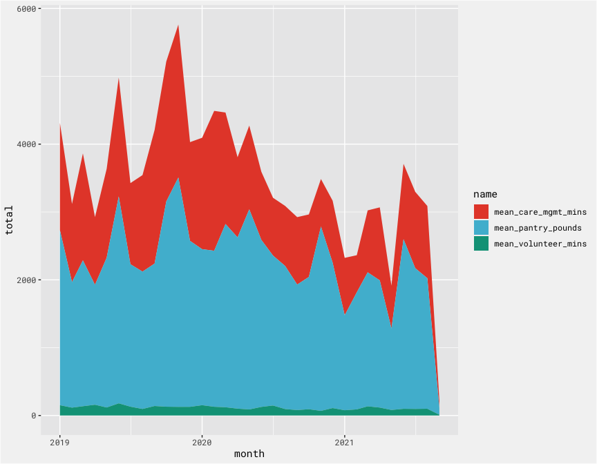<!-- -->

``` r
client_totals %>%
  select(anon_ID, month, ends_with("encounters")) %>%
  select(-starts_with("mean")) %>%
  pivot_longer(cols = 3:5) %>%
  group_by(month, name) %>%
  summarise(total = sum(value, na.rm = T)) %>%
  ggplot(aes(x = month, y = total, fill = name)) +
  geom_area()+ 
  bg_theme() +
  scale_fill_npg() +
  labs(title = "Encounters")
```

<!-- -->

``` r
client_totals %>%
  select(anon_ID, month, ends_with("mins")) %>%
  select(-starts_with("mean")) %>%
  pivot_longer(cols = 3:4) %>%
  group_by(month, name) %>%
  summarise(total = sum(value, na.rm = T)) %>%
  ggplot(aes(x = month, y = total, fill = name)) + 
  geom_area()+ 
  bg_theme() +
  scale_fill_npg() +
  labs(title = "Minutes")
```

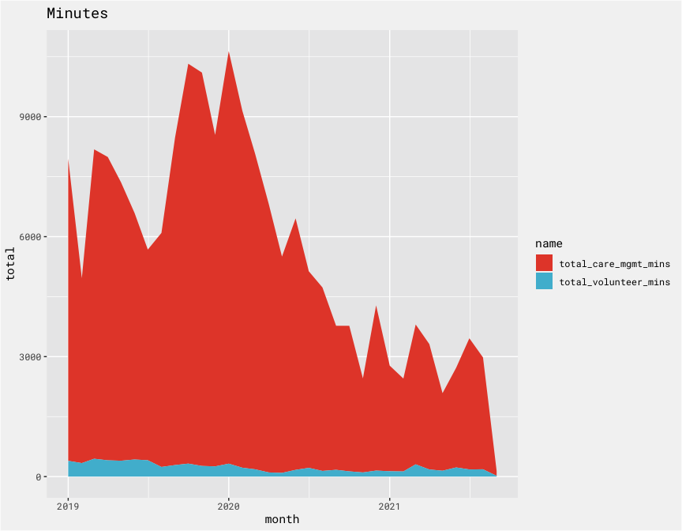<!-- -->

``` r
client_totals %>%
  select(anon_ID, month, ends_with("pounds")) %>%
  select(-starts_with("mean")) %>%
  group_by(month) %>%
  summarise(total = sum(total_pantry_pounds, na.rm = T)) %>%
  ggplot(aes(x = month, y = total)) + 
  geom_area(fill = bg_green, alpha = .65)+ 
  bg_theme() +
  labs(title = "total pantry pounds")
```

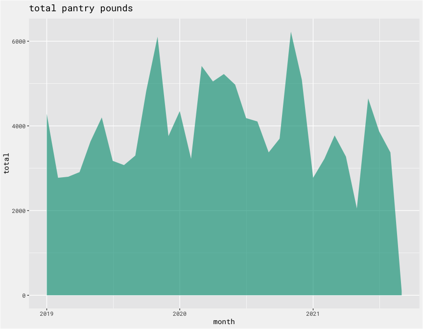<!-- -->
