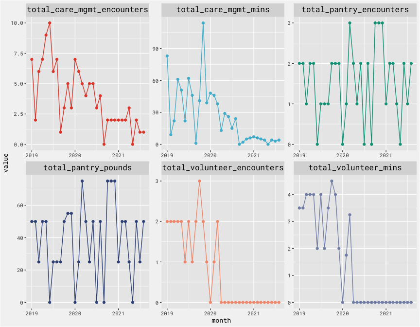
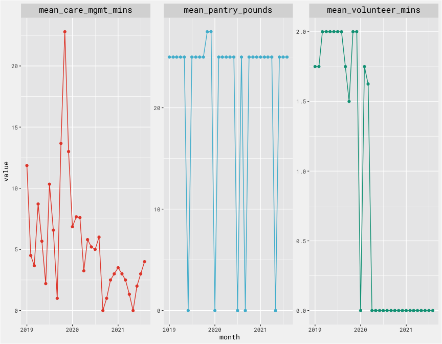

Exploring Utilziation Metric Idea
================

``` r
client <- 
  "210"

care_mgmt_util <-
  care_mgmt %>%
  filter(anon_ID == client) %>%
  mutate(month = as.Date(floor_date(assistance_date, 'month'))) %>%
  group_by(anon_ID, month) %>%
  summarise(total_care_mgmt_encounters = n(),
            total_care_mgmt_mins = sum(amount, na.rm = T),
            mean_care_mgmt_mins = mean(amount, na.rm = T))

pantry_util <- 
  pantry %>%
  filter(anon_ID == client) %>%
  mutate(month = as.Date(floor_date(mdy_hm(assistance_date), 'month'))) %>%
  group_by(anon_ID, month) %>%
  summarise(total_pantry_encounters = n(),
            total_pantry_pounds = sum(amount, na.rm = T),
            mean_pantry_pounds = mean(amount, na.rm = T))

volunteer_util <- 
  volunteer %>%
  filter(anon_ID == client) %>%
  mutate(month = as.Date(floor_date(mdy(appt_date), 'month'))) %>%
  group_by(anon_ID, month) %>%
  summarise(total_volunteer_encounters = n(),
            total_volunteer_mins = sum(appt_duration, na.rm = T),
            mean_volunteer_mins = mean(appt_duration, na.rm = T))

total_util <-
  client_info %>%
  filter(anon_ID == client) %>%
  select(anon_ID) %>%
  left_join(., care_mgmt_util, by = c("anon_ID")) %>%
  left_join(., pantry_util, by = c("anon_ID", "month")) %>%
  left_join(., volunteer_util, by = c("anon_ID", "month")) 
```

monthly total ElderNet services for single client:

``` r
total_util %>%
  select(month, starts_with("total")) %>%
  pivot_longer(2:ncol(.)) %>%
  padr::pad(group = "name") %>%
  padr::fill_by_value(value, 0) %>%
  ggplot(., aes(x = month, y = value, color = name)) + 
  geom_point() + 
  geom_line() + 
  facet_wrap(vars(name), scales = 'free') + 
  bg_theme(base_size = 10) + 
  scale_color_npg() + 
  theme(legend.position = 'none')
```

<!-- -->

monthly average ElderNet services for single client:

``` r
total_util %>%
  select(month, starts_with("mean")) %>%
  pivot_longer(2:ncol(.)) %>%
  padr::pad(group = "name") %>%
  padr::fill_by_value(value, 0) %>%
  ggplot(., aes(x = month, y = value, color = name)) + 
  geom_point() + 
  geom_line() + 
  facet_wrap(vars(name), scales = 'free') + 
  bg_theme(base_size = 10) + 
  scale_color_npg() + 
  theme(legend.position = 'none')
```

<!-- -->
