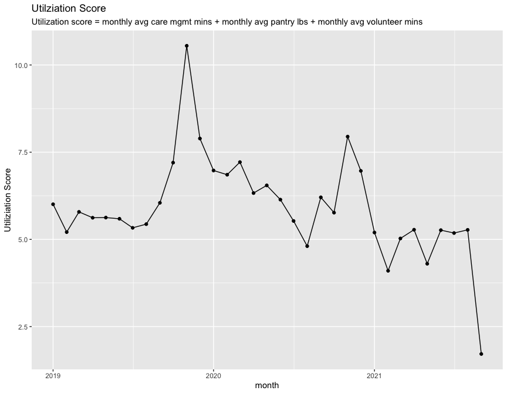
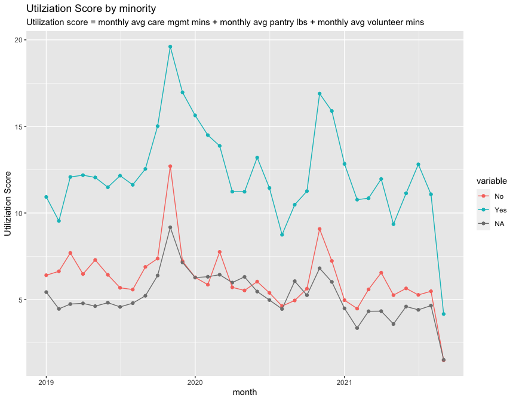
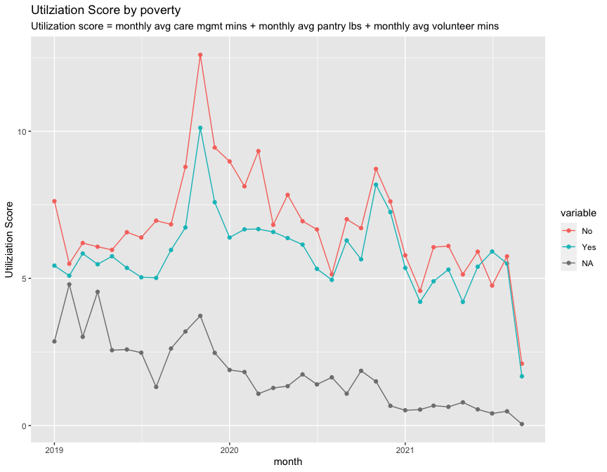

Effect of Povery/Minority/Age Group on ElderNet Utilziation
================

``` r
#load data
path <-
  list.files(path = here("data"), pattern = ".csv")

file_names <-
  c("care_mgmt", "client_info", "donations", "pantry", "volunteer")

path %>% 
  map( ~ read_csv(here("data", .))) %>% 
  set_names(file_names) %>%
  list2env(., envir = .GlobalEnv)
```

    ## <environment: R_GlobalEnv>

``` r
global_min <-
  min(
    c(
      min(as.Date(care_mgmt$assistance_date)),
      min(as.Date(mdy_hm(pantry$assistance_date))),
      min(as.Date(mdy(volunteer$appt_date)))
    )
  )

global_min
```

    ## [1] "2019-01-01"

``` r
global_max <- 
  max(
    c(
      max(as.Date(care_mgmt$assistance_date)),
      max(as.Date(mdy_hm(pantry$assistance_date))),
      max(as.Date(mdy(volunteer$appt_date)))
    )
  )


global_min
```

    ## [1] "2019-01-01"

``` r
global_max
```

    ## [1] "2021-09-15"

``` r
client_info_adj <- 
  client_info %>%
  select(anon_ID) %>%
  mutate(date = as.Date("2019-01-01")) %>%
  group_by(anon_ID) %>%
  padr::pad(group = "anon_ID", interval = "day", start_val = as.Date(global_min), end_val = as.Date(global_max))

# each client now has 1 entry per day
client_info_adj %>% 
  group_by(anon_ID) %>% 
  tally(name = "days")
```

    ## # A tibble: 641 × 2
    ##    anon_ID  days
    ##      <dbl> <int>
    ##  1       1   989
    ##  2       2   989
    ##  3       3   989
    ##  4       4   989
    ##  5       5   989
    ##  6       6   989
    ##  7       7   989
    ##  8       8   989
    ##  9       9   989
    ## 10      10   989
    ## # … with 631 more rows

``` r
client_info <- 
  client_info %>%
  inner_join(., client_info_adj, "anon_ID") %>%
  mutate(month = floor_date(date, 'month')) %>%
  select(-date) %>%
  ungroup() %>%
  distinct()

# rolled up into months - each client has 1 entry per 33 months
client_info %>% 
  group_by(anon_ID) %>% 
  tally(name = 'months')
```

    ## # A tibble: 641 × 2
    ##    anon_ID months
    ##      <dbl>  <int>
    ##  1       1     33
    ##  2       2     33
    ##  3       3     33
    ##  4       4     33
    ##  5       5     33
    ##  6       6     33
    ##  7       7     33
    ##  8       8     33
    ##  9       9     33
    ## 10      10     33
    ## # … with 631 more rows

``` r
client <- 
  "210"

care_mgmt_util <-
  care_mgmt %>%
  # filter(anon_ID == client) %>%
  mutate(month = as.Date(floor_date(assistance_date, 'month'))) %>%
  group_by(anon_ID, month) %>%
  summarise(total_care_mgmt_encounters = n(),
            total_care_mgmt_mins = sum(amount, na.rm = T),
            mean_care_mgmt_mins = mean(amount, na.rm = T))

care_mgmt_util %>% 
  filter(anon_ID == client)
```

    ## # A tibble: 30 × 5
    ## # Groups:   anon_ID [1]
    ##    anon_ID month      total_care_mgmt_enco… total_care_mgmt_m… mean_care_mgmt_m…
    ##      <dbl> <date>                     <int>              <dbl>             <dbl>
    ##  1     210 2019-01-01                     7                 83             11.9 
    ##  2     210 2019-02-01                     2                  9              4.5 
    ##  3     210 2019-03-01                     6                 22              3.67
    ##  4     210 2019-04-01                     7                 61              8.71
    ##  5     210 2019-05-01                     9                 51              5.67
    ##  6     210 2019-06-01                    10                 22              2.2 
    ##  7     210 2019-07-01                     6                 62             10.3 
    ##  8     210 2019-08-01                     7                 46              6.57
    ##  9     210 2019-09-01                     1                  1              1   
    ## 10     210 2019-10-01                     3                 41             13.7 
    ## # … with 20 more rows

``` r
pantry_util <- 
  pantry %>%
  # filter(anon_ID == client) %>%
  mutate(month = as.Date(floor_date(mdy_hm(assistance_date), 'month'))) %>%
  group_by(anon_ID, month) %>%
  summarise(total_pantry_encounters = n(),
            total_pantry_pounds = sum(amount, na.rm = T),
            mean_pantry_pounds = mean(amount, na.rm = T))

pantry_util %>% 
  filter(anon_ID == client)
```

    ## # A tibble: 30 × 5
    ## # Groups:   anon_ID [1]
    ##    anon_ID month      total_pantry_encounters total_pantry_pou… mean_pantry_pou…
    ##      <dbl> <date>                       <int>             <dbl>            <dbl>
    ##  1     210 2019-01-01                       2                50             25  
    ##  2     210 2019-02-01                       2                50             25  
    ##  3     210 2019-03-01                       1                25             25  
    ##  4     210 2019-04-01                       2                50             25  
    ##  5     210 2019-05-01                       2                50             25  
    ##  6     210 2019-07-01                       1                25             25  
    ##  7     210 2019-08-01                       1                25             25  
    ##  8     210 2019-09-01                       1                25             25  
    ##  9     210 2019-10-01                       2                50             25  
    ## 10     210 2019-11-01                       2                55             27.5
    ## # … with 20 more rows

``` r
volunteer_util <- 
  volunteer %>%
  # filter(anon_ID == client) %>%
  mutate(month = as.Date(floor_date(mdy(appt_date), 'month'))) %>%
  group_by(anon_ID, month) %>%
  summarise(total_volunteer_encounters = n(),
            total_volunteer_mins = sum(appt_duration, na.rm = T),
            mean_volunteer_mins = mean(appt_duration, na.rm = T))

volunteer_util %>% 
  filter(anon_ID == client)
```

    ## # A tibble: 14 × 5
    ## # Groups:   anon_ID [1]
    ##    anon_ID month      total_volunteer_enco… total_volunteer_m… mean_volunteer_m…
    ##      <dbl> <date>                     <int>              <dbl>             <dbl>
    ##  1     210 2019-01-01                     2               3.5               1.75
    ##  2     210 2019-02-01                     2               3.5               1.75
    ##  3     210 2019-03-01                     2               4                 2   
    ##  4     210 2019-04-01                     2               4                 2   
    ##  5     210 2019-05-01                     2               4                 2   
    ##  6     210 2019-06-01                     1               2                 2   
    ##  7     210 2019-07-01                     2               4                 2   
    ##  8     210 2019-08-01                     1               2                 2   
    ##  9     210 2019-09-01                     2               3.5               1.75
    ## 10     210 2019-10-01                     3               4.5               1.5 
    ## 11     210 2019-11-01                     2               4                 2   
    ## 12     210 2019-12-01                     1               2                 2   
    ## 13     210 2020-02-01                     1               1.75              1.75
    ## 14     210 2020-03-01                     2               3.25              1.62

``` r
monthly_util <-
  client_info %>%
  left_join(., care_mgmt_util, by = c("anon_ID", "month")) %>%
  left_join(., pantry_util, by = c("anon_ID", "month")) %>% 
  left_join(., volunteer_util, by = c("anon_ID", "month")) %>% 
  ungroup() %>%
  as_tibble() %>% 
  rowwise() %>% 
  mutate(util = sum(mean_care_mgmt_mins, mean_pantry_pounds, mean_volunteer_mins, na.rm = T)) 

monthly_util %>% 
  filter(anon_ID == client)
```

    ## # A tibble: 33 × 16
    ## # Rowwise: 
    ##    anon_ID county     poverty minority age_group month      total_care_mgmt_enc…
    ##      <dbl> <chr>      <chr>   <chr>    <chr>     <date>                    <int>
    ##  1     210 Montgomery No      Yes      P         2019-01-01                    7
    ##  2     210 Montgomery No      Yes      P         2019-02-01                    2
    ##  3     210 Montgomery No      Yes      P         2019-03-01                    6
    ##  4     210 Montgomery No      Yes      P         2019-04-01                    7
    ##  5     210 Montgomery No      Yes      P         2019-05-01                    9
    ##  6     210 Montgomery No      Yes      P         2019-06-01                   10
    ##  7     210 Montgomery No      Yes      P         2019-07-01                    6
    ##  8     210 Montgomery No      Yes      P         2019-08-01                    7
    ##  9     210 Montgomery No      Yes      P         2019-09-01                    1
    ## 10     210 Montgomery No      Yes      P         2019-10-01                    3
    ## # … with 23 more rows, and 9 more variables: total_care_mgmt_mins <dbl>,
    ## #   mean_care_mgmt_mins <dbl>, total_pantry_encounters <int>,
    ## #   total_pantry_pounds <dbl>, mean_pantry_pounds <dbl>,
    ## #   total_volunteer_encounters <int>, total_volunteer_mins <dbl>,
    ## #   mean_volunteer_mins <dbl>, util <dbl>

``` r
monthly_util %>%
  group_by(month) %>%
  summarise(mean_util = mean(util, na.rm = T),
            sd_util = sd(util, na.rm = T)) %>%
  ggplot(aes(x = month, y = mean_util)) +
  geom_point() +
  geom_line() + 
  labs(x = "month", y = "Utiliziation Score", title = "Utilziation Score",
       subtitle = "Utilization score = monthly avg care mgmt mins + monthly avg pantry lbs + monthly avg volunteer mins")
```

<!-- -->

``` r
plot_data  <- 
  function(data, variable){
    
    data %>%
      select(month, one_of(variable), util) %>%
      rename(variable = 2) %>%
      group_by(month, variable) %>%
      summarise(mean_util = mean(util, na.rm = T),
                sd_util = sd(util, na.rm = T)) %>%
      ggplot(aes(x = month, y = mean_util, color = variable)) +
      geom_point() +
      geom_line() + 
      labs(x = "month", y = "Utiliziation Score", title = glue::glue("Utilziation Score by {variable}"),
           subtitle = "Utilization score = monthly avg care mgmt mins + monthly avg pantry lbs + monthly avg volunteer mins")
    
  }

plot_data(monthly_util, "minority")
```

<!-- -->

``` r
plot_data(monthly_util, "poverty")
```

<!-- -->

``` r
plot_data(monthly_util, "age_group")
```

<!-- -->
