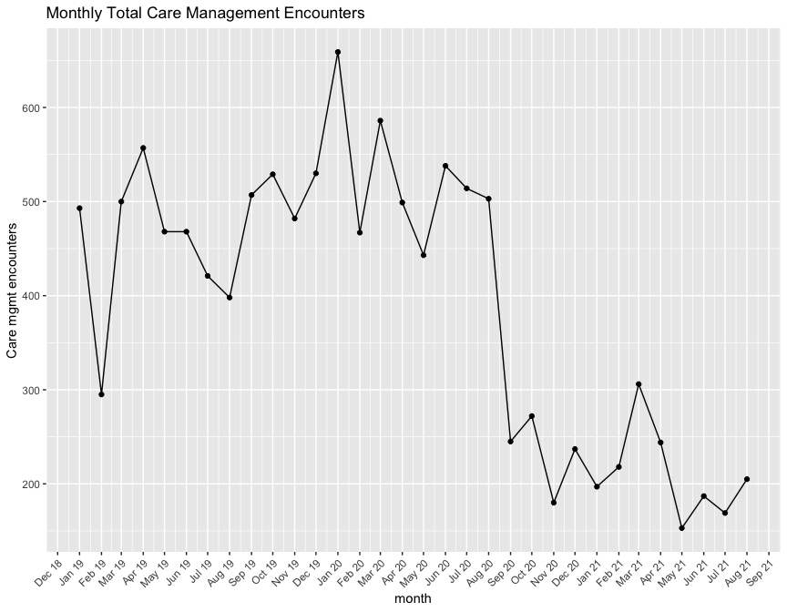
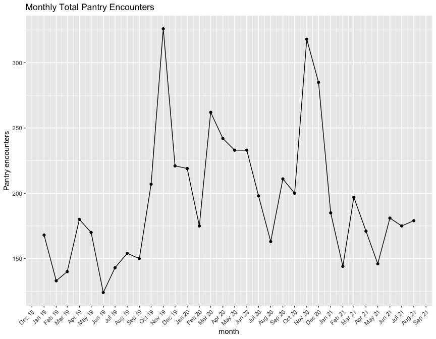
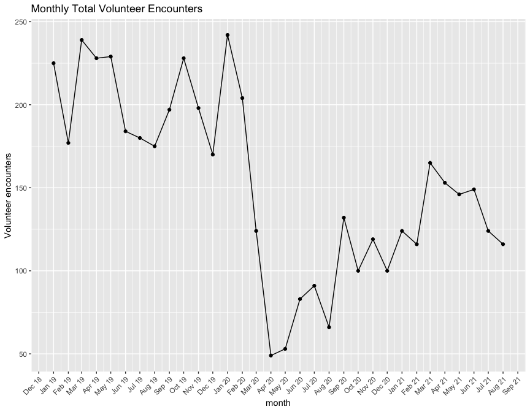
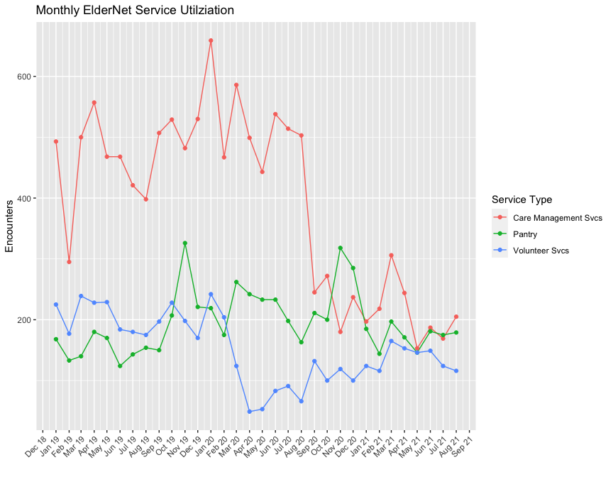
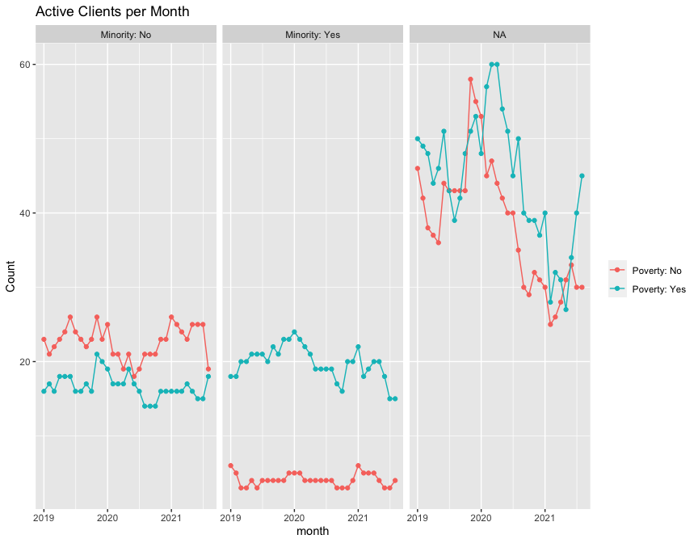
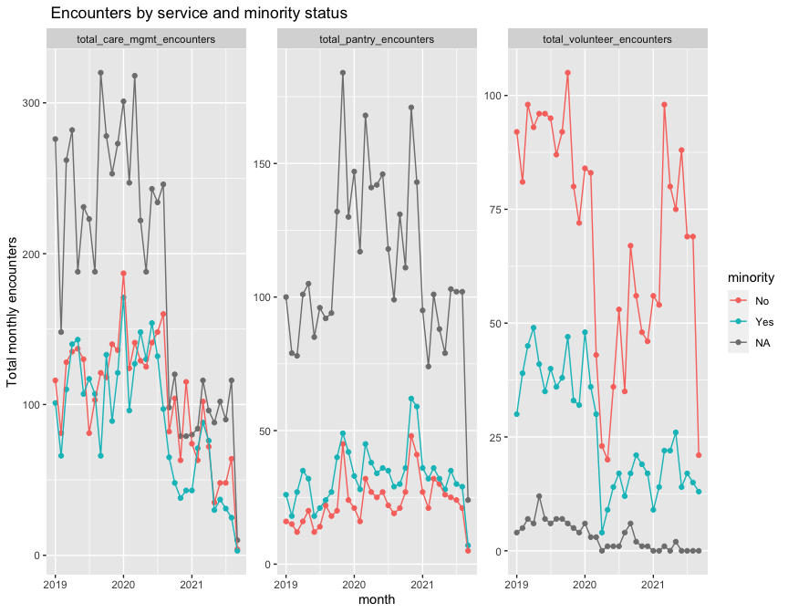
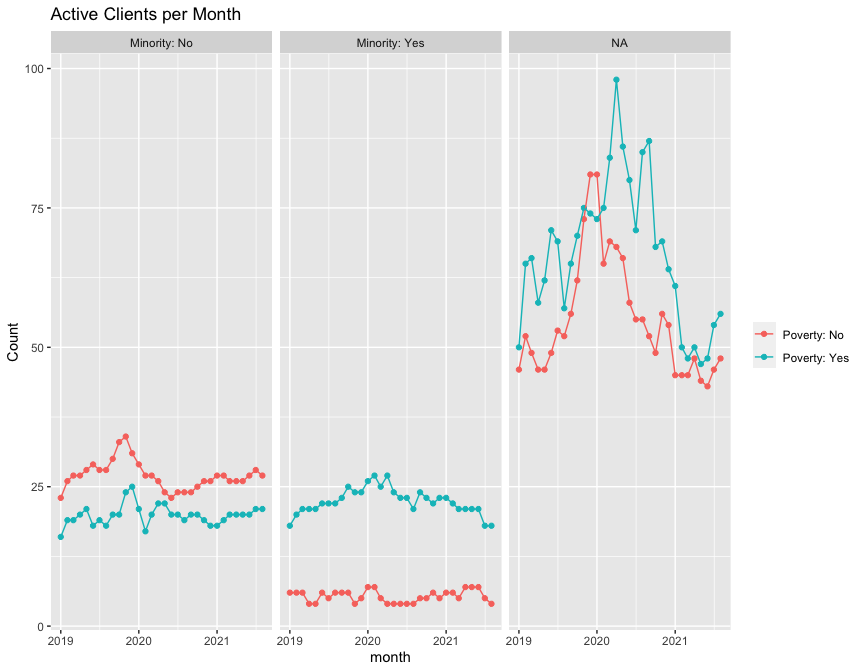
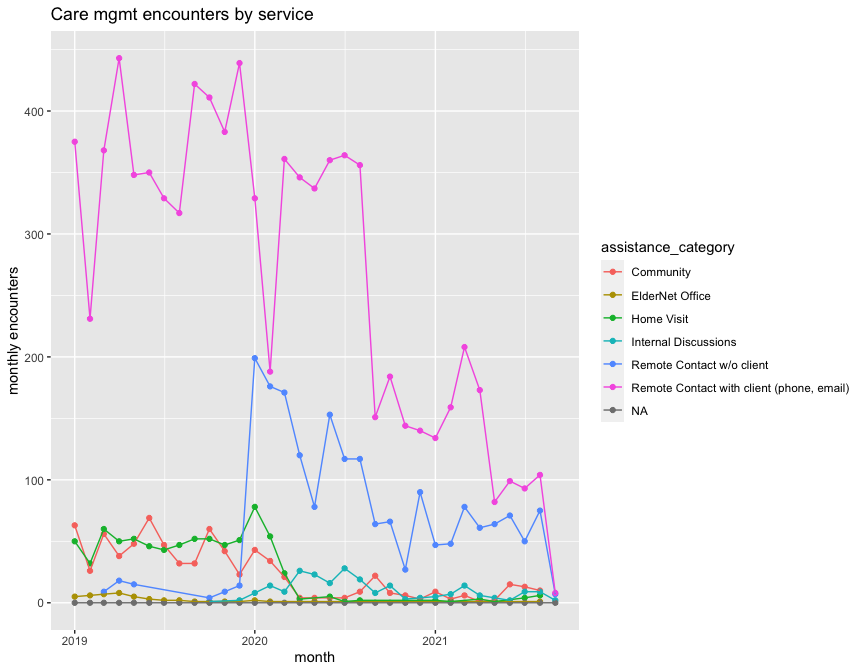
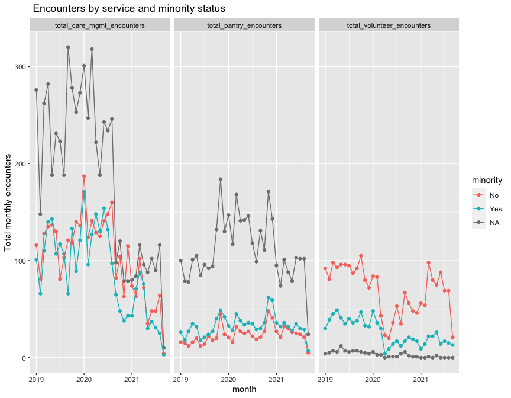

ElderNet Utiliziation Working Doc
================

``` r
#load data
path <-
  list.files(path = here("data"), pattern = ".csv")

file_names <-
  c("care_mgmt", "client_info", "donations", "pantry", "volunteer")

path %>% 
  map( ~ read_csv(here("data", .))) %>% 
  set_names(file_names) %>%
  list2env(., envir = .GlobalEnv)
```

    ## <environment: R_GlobalEnv>

## prep the data

Not every client has an interaction with each service each month. For
example, a client may use volunteer services this month, then in 2
months later visit the pantry leaving a 1 month gap in their
utilization. To get a tidy dataset where we have 1 row per client per
month, I created a ‘master calendar’ for each client, starting from the
first date in the data set and ending at the last date. Later on I
adjust this for the date of each client’s first interaction.

``` r
global_min <-
  min(
    c(
      min(as.Date(care_mgmt$assistance_date)),
      min(as.Date(mdy_hm(pantry$assistance_date))),
      min(as.Date(mdy(volunteer$appt_date)))
    )
  )

global_min
```

    ## [1] "2019-01-01"

``` r
global_max <- 
  max(
    c(
      max(as.Date(care_mgmt$assistance_date)),
      max(as.Date(mdy_hm(pantry$assistance_date))),
      max(as.Date(mdy(volunteer$appt_date)))
    )
  )

global_max
```

    ## [1] "2021-09-15"

“Padding” the client data set results in each client having the same
number of observations - each client has the same number of rows now
representing the number of days between the min and max dates:

``` r
client_info_adj <- 
  client_info %>%
  select(anon_ID) %>%
  mutate(date = as.Date("2019-01-01")) %>%
  group_by(anon_ID) %>%
  padr::pad(group = "anon_ID", interval = "day", start_val = as.Date(global_min), end_val = as.Date(global_max))

# each client now has 1 entry per day
client_info_adj %>% 
  group_by(anon_ID) %>% 
  tally(name = "days")
```

    ## # A tibble: 641 × 2
    ##    anon_ID  days
    ##      <dbl> <int>
    ##  1       1   989
    ##  2       2   989
    ##  3       3   989
    ##  4       4   989
    ##  5       5   989
    ##  6       6   989
    ##  7       7   989
    ##  8       8   989
    ##  9       9   989
    ## 10      10   989
    ## # … with 631 more rows

Rolling up to the month, now each client has 1 observation per month.
Prepping the data this way will allow us to join the care mgmt, pantry
and volunteer data to the client data for each client for each month,
which will preserve instances where a client had 0 interactions in a
given month.

``` r
client_info <- 
  client_info %>%
  inner_join(., client_info_adj, "anon_ID") %>%
  mutate(month = floor_date(date, 'month')) %>%
  select(-date) %>%
  ungroup() %>%
  distinct()

# rolled up into months - each client has 1 entry per 33 months
client_info %>% 
  group_by(anon_ID) %>% 
  tally(name = 'months')
```

    ## # A tibble: 641 × 2
    ##    anon_ID months
    ##      <dbl>  <int>
    ##  1       1     33
    ##  2       2     33
    ##  3       3     33
    ##  4       4     33
    ##  5       5     33
    ##  6       6     33
    ##  7       7     33
    ##  8       8     33
    ##  9       9     33
    ## 10      10     33
    ## # … with 631 more rows

Example output:

``` r
client_info %>% 
  filter(anon_ID == "210")
```

    ## # A tibble: 33 × 6
    ##    anon_ID county     poverty minority age_group month     
    ##      <dbl> <chr>      <chr>   <chr>    <chr>     <date>    
    ##  1     210 Montgomery No      Yes      P         2019-01-01
    ##  2     210 Montgomery No      Yes      P         2019-02-01
    ##  3     210 Montgomery No      Yes      P         2019-03-01
    ##  4     210 Montgomery No      Yes      P         2019-04-01
    ##  5     210 Montgomery No      Yes      P         2019-05-01
    ##  6     210 Montgomery No      Yes      P         2019-06-01
    ##  7     210 Montgomery No      Yes      P         2019-07-01
    ##  8     210 Montgomery No      Yes      P         2019-08-01
    ##  9     210 Montgomery No      Yes      P         2019-09-01
    ## 10     210 Montgomery No      Yes      P         2019-10-01
    ## # … with 23 more rows

## get ElderNet encounters

this section counts client encounters for each month for each service
offered. We can join all of these with the client data to try to
summarize utilization.

#### care management

``` r
care_mgmt_util <-
  care_mgmt %>%
  mutate(month = as.Date(floor_date(assistance_date, 'month'))) %>%
  group_by(anon_ID, month) %>%
  summarise(total_care_mgmt_encounters = n(),
            total_care_mgmt_mins = sum(amount, na.rm = T),
            mean_care_mgmt_mins = mean(amount, na.rm = T))

care_mgmt %>%
  mutate(month = as.Date(floor_date(assistance_date, 'month'))) %>%
  group_by(month) %>%
  summarise(tot_encoutners = n()) %>%
  mutate(type = "Care Management") %>%
  filter(month < max(month)) %>%
  ggplot(., aes(x = month, y = tot_encoutners)) + 
  geom_line() + 
  geom_point() + 
  scale_x_date(breaks = scales::date_breaks("1 month"), date_labels = "%b %y",
               guide = guide_axis(angle = 45)) + 
  labs(x = 'month', y ='Care mgmt encounters', title = "Monthly Total Care Management Encounters")
```

<!-- -->

``` r
#example output for client 210
care_mgmt_util %>% 
  filter(anon_ID == "210")
```

    ## # A tibble: 30 × 5
    ## # Groups:   anon_ID [1]
    ##    anon_ID month      total_care_mgmt_enco… total_care_mgmt_m… mean_care_mgmt_m…
    ##      <dbl> <date>                     <int>              <dbl>             <dbl>
    ##  1     210 2019-01-01                     7                 83             11.9 
    ##  2     210 2019-02-01                     2                  9              4.5 
    ##  3     210 2019-03-01                     6                 22              3.67
    ##  4     210 2019-04-01                     7                 61              8.71
    ##  5     210 2019-05-01                     9                 51              5.67
    ##  6     210 2019-06-01                    10                 22              2.2 
    ##  7     210 2019-07-01                     6                 62             10.3 
    ##  8     210 2019-08-01                     7                 46              6.57
    ##  9     210 2019-09-01                     1                  1              1   
    ## 10     210 2019-10-01                     3                 41             13.7 
    ## # … with 20 more rows

#### pantry

``` r
pantry_util <- 
  pantry %>%
  mutate(month = as.Date(floor_date(mdy_hm(assistance_date), 'month'))) %>%
  group_by(anon_ID, month) %>%
  summarise(total_pantry_encounters = n(),
            total_pantry_pounds = sum(amount, na.rm = T),
            mean_pantry_pounds = mean(amount, na.rm = T))

pantry %>%
  mutate(month = as.Date(floor_date(mdy_hm(assistance_date), 'month'))) %>%
  group_by(month) %>%
  summarise(total_pantry_encounters = n())  %>%
  filter(month < max(month)) %>%
  ggplot(., aes(x = month, y = total_pantry_encounters)) + 
  geom_line() + 
  geom_point() + 
  scale_x_date(breaks = scales::date_breaks("1 month"), date_labels = "%b %y",
               guide = guide_axis(angle = 45)) + 
  labs(x = 'month', y ='Pantry encounters', title = "Monthly Total Pantry Encounters")
```

<!-- -->

``` r
#example output for client 210
pantry_util %>% 
  filter(anon_ID == "210")
```

    ## # A tibble: 30 × 5
    ## # Groups:   anon_ID [1]
    ##    anon_ID month      total_pantry_encounters total_pantry_pou… mean_pantry_pou…
    ##      <dbl> <date>                       <int>             <dbl>            <dbl>
    ##  1     210 2019-01-01                       2                50             25  
    ##  2     210 2019-02-01                       2                50             25  
    ##  3     210 2019-03-01                       1                25             25  
    ##  4     210 2019-04-01                       2                50             25  
    ##  5     210 2019-05-01                       2                50             25  
    ##  6     210 2019-07-01                       1                25             25  
    ##  7     210 2019-08-01                       1                25             25  
    ##  8     210 2019-09-01                       1                25             25  
    ##  9     210 2019-10-01                       2                50             25  
    ## 10     210 2019-11-01                       2                55             27.5
    ## # … with 20 more rows

#### volunteer services

``` r
volunteer_util <- 
  volunteer %>%
  mutate(month = as.Date(floor_date(mdy(appt_date), 'month'))) %>% 
  group_by(anon_ID, month) %>%
  summarise(total_volunteer_encounters = n(),
            total_volunteer_mins = sum(appt_duration, na.rm = T),
            mean_volunteer_mins = mean(appt_duration, na.rm = T))

volunteer %>%
  mutate(month = as.Date(floor_date(mdy(appt_date), 'month'))) %>% 
  group_by(month) %>%
  summarise(total = n()) %>%
  filter(month < max(month)) %>%
  ggplot(., aes(x = month, y = total)) + 
  geom_line() + 
  geom_point() + 
  scale_x_date(breaks = scales::date_breaks("1 month"), date_labels = "%b %y",
               guide = guide_axis(angle = 45)) + 
  labs(x = 'month', y ='Volunteer encounters', title = "Monthly Total Volunteer Encounters")
```

<!-- -->

``` r
#example output for client 210
volunteer_util %>% 
  filter(anon_ID == "210")
```

    ## # A tibble: 14 × 5
    ## # Groups:   anon_ID [1]
    ##    anon_ID month      total_volunteer_enco… total_volunteer_m… mean_volunteer_m…
    ##      <dbl> <date>                     <int>              <dbl>             <dbl>
    ##  1     210 2019-01-01                     2               3.5               1.75
    ##  2     210 2019-02-01                     2               3.5               1.75
    ##  3     210 2019-03-01                     2               4                 2   
    ##  4     210 2019-04-01                     2               4                 2   
    ##  5     210 2019-05-01                     2               4                 2   
    ##  6     210 2019-06-01                     1               2                 2   
    ##  7     210 2019-07-01                     2               4                 2   
    ##  8     210 2019-08-01                     1               2                 2   
    ##  9     210 2019-09-01                     2               3.5               1.75
    ## 10     210 2019-10-01                     3               4.5               1.5 
    ## 11     210 2019-11-01                     2               4                 2   
    ## 12     210 2019-12-01                     1               2                 2   
    ## 13     210 2020-02-01                     1               1.75              1.75
    ## 14     210 2020-03-01                     2               3.25              1.62

``` r
cols <- 
  c("#2F3D4B",
    "#5D5177",
    "410A45")

data <- 
  bind_rows(
  care_mgmt %>%
    mutate(month = as.Date(floor_date(assistance_date, 'month'))) %>%
    group_by(month) %>%
    summarise(tot_encoutners = n()) %>%
    mutate(type = "Care Management Svcs"),
  
  pantry %>%
    mutate(month = as.Date(floor_date(mdy_hm(assistance_date), 'month'))) %>%
    group_by(month) %>%
    summarise(tot_encoutners = n()) %>%
    mutate(type = "Pantry"),
  
  volunteer %>%
    mutate(month = as.Date(floor_date(mdy(appt_date), 'month'))) %>% 
    group_by(month) %>%
    summarise(tot_encoutners = n()) %>%
    mutate(type = "Volunteer Svcs")) %>%
  filter(month < max(month))

data %>%
  ggplot(., aes(x = month, y = tot_encoutners, color = type)) +
  geom_line(aes(color = type)) +
  geom_point(aes(color = type)) +
  # scale_colour_manual(values = c("#2F3D4B",
  #                                "#5D5177",
  #                                "410A45")) %>%
  scale_x_date(breaks = scales::date_breaks("1 month"), date_labels = "%b %y",
               guide = guide_axis(angle = 45)) + 
  labs(x = '', y ='Encounters', title = "Monthly ElderNet Service Utilziation", color = "Service Type")
```

<!-- -->
### get utilziation

Here all datasets are joined together and then services used for each
client for each month are calculated. There are columns for the total
encounters as well as binary indicator columns for if each type of
service was used or not (regardless of how much of that service was
used).

``` r
monthly_util <-
  client_info %>%
  left_join(., care_mgmt_util, by = c("anon_ID", "month")) %>%
  left_join(., pantry_util, by = c("anon_ID", "month")) %>% 
  left_join(., volunteer_util, by = c("anon_ID", "month")) %>% 
  ungroup() %>%
  as_tibble() %>% 
  rowwise() %>% 
  mutate(across(where(is.numeric), ~(ifelse(is.na(.x), 0, .)))) %>%
  mutate(used_care_mgmt = ifelse(total_care_mgmt_encounters >= 1, 1, 0),
         used_pantry = ifelse(total_pantry_encounters >= 1, 1, 0),
         used_volunteer = ifelse(total_volunteer_encounters >=1, 1, 0)) %>%
  ungroup() %>%
  rowwise() %>%
  mutate(num_svcs_used = sum(used_care_mgmt, used_pantry, used_volunteer, na.rm = T)) %>%
  as_tibble()
```

Finally, we need to adjust the utilization dataset to take into account
each client’s first month. We can remove all rows before each client’s
first date:

``` r
global_min_client_dates <- 
  care_mgmt %>%
  mutate(assistance_date = as.Date(assistance_date)) %>%
  select(anon_ID, care_mgmt_assistance_date = assistance_date) %>%
  left_join(., pantry %>%
              mutate(assistance_date = as.Date(assistance_date, format = '%m/%d/%Y')) %>% 
              select(anon_ID, pantry_assistance_date = assistance_date)) %>%
  left_join(., volunteer %>% 
              mutate(rider_first_ride_date = as.Date(rider_first_ride_date)) %>%
              select(anon_ID, rider_first_ride_date)) %>%
  distinct() %>%
  group_by(anon_ID) %>%
  summarize(min_care_mgmt_assistance_date = min(care_mgmt_assistance_date, na.rm = TRUE),
            min_pantry_assistance_date = min(pantry_assistance_date, na.rm = TRUE),
            min_rider_first_ride_date = min(rider_first_ride_date, na.rm = TRUE))

global_min_client_dates <- 
  tibble(
    anon_ID = global_min_client_dates$anon_ID,
    enrollment_date = apply(global_min_client_dates[, 2:ncol(global_min_client_dates)], 1, min, na.rm = TRUE)
  ) %>% 
  mutate(enrollment_month = floor_date(ymd(enrollment_date), "month"))

monthly_util <- 
  monthly_util %>%
  left_join(., global_min_client_dates) %>%
  mutate(active_period = ifelse(month >= enrollment_month, 1, 0)) %>%
  filter(active_period == 1)
```

Example output (some columns left out for display purposes)

``` r
monthly_util %>% 
  filter(anon_ID == "210") %>%
  select(anon_ID, month, starts_with("used"), num_svcs_used)
```

    ## # A tibble: 33 × 6
    ##    anon_ID month      used_care_mgmt used_pantry used_volunteer num_svcs_used
    ##      <dbl> <date>              <dbl>       <dbl>          <dbl>         <dbl>
    ##  1     210 2019-01-01              1           1              1             3
    ##  2     210 2019-02-01              1           1              1             3
    ##  3     210 2019-03-01              1           1              1             3
    ##  4     210 2019-04-01              1           1              1             3
    ##  5     210 2019-05-01              1           1              1             3
    ##  6     210 2019-06-01              1           0              1             2
    ##  7     210 2019-07-01              1           1              1             3
    ##  8     210 2019-08-01              1           1              1             3
    ##  9     210 2019-09-01              1           1              1             3
    ## 10     210 2019-10-01              1           1              1             3
    ## # … with 23 more rows

Below is an example of why the master calendar was helpful. Client 1
used very little services, and its important to have all the months
where no services where used.

``` r
monthly_util %>% 
  filter(anon_ID == 1) %>%
  select(anon_ID, month, starts_with("used"), num_svcs_used) %>%
  print(n = 40)
```

    ## # A tibble: 4 × 6
    ##   anon_ID month      used_care_mgmt used_pantry used_volunteer num_svcs_used
    ##     <dbl> <date>              <dbl>       <dbl>          <dbl>         <dbl>
    ## 1       1 2021-06-01              1           0              0             1
    ## 2       1 2021-07-01              1           0              0             1
    ## 3       1 2021-08-01              0           0              0             0
    ## 4       1 2021-09-01              0           0              0             0

#### active clients

the function below is an attempt to define ‘active clients’. Since
adding up the various encounters poses problems since they are different
scales, and units (minutes vs pounds vs visits) I’m thinking this can be
used a proxy for utilization? it can indicate how many clients
consistently use services over time.

The logic is, for each client:

-   for each client for each month, calculate the number of ElderNet
    services they engaged with. This number will range from a minimum of
    0 if they didn’t use any services, to a maximum of 3 if a client
    used the pantry, volunteer services and care mgmt services in that
    month.
-   calculate a rolling mean of services a client engaged with both over
    the past 2 months, and over the past 3 months
-   check if that rolling mean is over a threshold, and if so define
    that client as being active in that month
-   several thresholds are defined for the sake of example

``` r
get_active_clients <-
  function(data, client, lookback = 2, threshold = 1){
    # 
    # client <- 610
    # data <- monthly_util
    # lookback <- 2

    data %>%
      ungroup() %>%
      filter(anon_ID == {{client}}) %>%
      mutate(lookback_mean_2mo = round(slider::slide_dbl(num_svcs_used, mean, .before = 1, .after = 0), 2),
             lookback_mean_3mo = round(slider::slide_dbl(num_svcs_used, mean, .before = 2, .after = 0), 2),
             
             # used at least 1 svc offered (pantry, volunteer, care mgmt) in 2 of the 2 previous months
             active_client_2mo = ifelse(lookback_mean_2mo >= 1, 1, 0), 
              
             # used at least 1 svc offered (pantry, volunteer, care mgmt) in 3 of the 3 previous months
             active_client_3mo = ifelse(lookback_mean_3mo >= 1, 1, 0),
             
             # used at least 1 svc offered (pantry, volunteer, care mgmt) in 1 of the 2 previous months
             active_client_2mo_relaxed = ifelse(lookback_mean_2mo >= .5, 1, 0),
             
             # used at least 1 svc offered (pantry, volunteer, care mgmt) in 2 of the 3 previous months
             active_client_3mo_relaxed = ifelse(lookback_mean_3mo >= .67, 1, 0),
             
             # used at least 1 svc offered (pantry, volunteer, care mgmt) in 1 of the 3 previous months
             active_client_3mo_extra_relaxed = ifelse(lookback_mean_3mo >= .33, 1, 0)
             ) 
  }

client_ids <- 
  sort(unique(monthly_util$anon_ID))

active_clients <- 
  map_dfr(client_ids, ~get_active_clients(data = monthly_util, client = .x))
```

**Examples**

Client 610 for the 12 months in 2020 fell into and out of being an
active client at different times depending on the metric being used.

``` r
active_clients %>% 
  filter(anon_ID == "610",
         month >= "2020-01-01",
         month <= "2020-12-31") %>%
  select(month, anon_ID, num_svcs_used, starts_with("lookback"), starts_with("active")) %>%
  select(-active_period) %>% 
  print(n = 12)
```

    ## # A tibble: 12 × 10
    ##    month      anon_ID num_svcs_used lookback_mean_2mo lookback_mean_3mo
    ##    <date>       <dbl>         <dbl>             <dbl>             <dbl>
    ##  1 2020-01-01     610             0               0                0.33
    ##  2 2020-02-01     610             0               0                0   
    ##  3 2020-03-01     610             0               0                0   
    ##  4 2020-04-01     610             0               0                0   
    ##  5 2020-05-01     610             1               0.5              0.33
    ##  6 2020-06-01     610             1               1                0.67
    ##  7 2020-07-01     610             1               1                1   
    ##  8 2020-08-01     610             0               0.5              0.67
    ##  9 2020-09-01     610             0               0                0.33
    ## 10 2020-10-01     610             0               0                0   
    ## 11 2020-11-01     610             0               0                0   
    ## 12 2020-12-01     610             0               0                0   
    ## # … with 5 more variables: active_client_2mo <dbl>, active_client_3mo <dbl>,
    ## #   active_client_2mo_relaxed <dbl>, active_client_3mo_relaxed <dbl>,
    ## #   active_client_3mo_extra_relaxed <dbl>

``` r
  # reactable::reactable(resizable = T, wrap = F, defaultPageSize = 12)
```

On the other hand, client 210 was an active client each month in 2020 no
matter which metric is used:

``` r
active_clients %>% 
  filter(anon_ID == "210",
         month >= "2020-01-01",
         month <= "2020-12-31") %>%
  select(month, anon_ID, num_svcs_used, starts_with("lookback"), starts_with("active")) %>%
  select(-active_period) %>% 
  print(n = 12)
```

    ## # A tibble: 12 × 10
    ##    month      anon_ID num_svcs_used lookback_mean_2mo lookback_mean_3mo
    ##    <date>       <dbl>         <dbl>             <dbl>             <dbl>
    ##  1 2020-01-01     210             1               2                2.33
    ##  2 2020-02-01     210             3               2                2.33
    ##  3 2020-03-01     210             3               3                2.33
    ##  4 2020-04-01     210             2               2.5              2.67
    ##  5 2020-05-01     210             2               2                2.33
    ##  6 2020-06-01     210             2               2                2   
    ##  7 2020-07-01     210             1               1.5              1.67
    ##  8 2020-08-01     210             2               1.5              1.67
    ##  9 2020-09-01     210             1               1.5              1.33
    ## 10 2020-10-01     210             2               1.5              1.67
    ## 11 2020-11-01     210             2               2                1.67
    ## 12 2020-12-01     210             2               2                2   
    ## # … with 5 more variables: active_client_2mo <dbl>, active_client_3mo <dbl>,
    ## #   active_client_2mo_relaxed <dbl>, active_client_3mo_relaxed <dbl>,
    ## #   active_client_3mo_extra_relaxed <dbl>

``` r
  # reactable::reactable(resizable = T, wrap = F, defaultPageSize = 12)
```

Plotting the different measure of active clients shows the effect of
relaxing the definition allows more clients to fall into the ‘active’
definition each month.

``` r
active_clients %>%
  ungroup() %>%
  group_by(month) %>%
  summarise(`2 month strict` = sum(active_client_2mo),
            `3 month strict` = sum(active_client_3mo),
            `2 month relaxed`= sum(active_client_2mo_relaxed),
            `3 month relaxed` = sum(active_client_3mo_relaxed),
            `3 month extra relaxed` = sum(active_client_3mo_extra_relaxed),
            ) %>% 
  pivot_longer(2:6) %>%
  mutate(category = ifelse(name %in% c("2 month strict", '3 month strict'), 'Strict Definition', "Relaxed Definition")) %>%
  filter(month < max(month)) %>%
  ggplot(., aes(x = month, y = value, color = name)) + 
  geom_point() + 
  geom_line() + 
  labs(x = 'month', y = "Count", title = 'Active Clients per Month') + 
  scale_color_npg() + 
  # facet_wrap(vars(category))  +
  labs(x = 'Month', y = 'Active Clients', color = 'Metric', title = 'Montly Active Clients Across Definition Types')
```

<!-- -->

``` r
active_clients %>%
  ungroup() %>%
  group_by(month) %>%
  summarise(`2 month strict` = sum(active_client_2mo),
            `3 month strict` = sum(active_client_3mo),
            `2 month relaxed`= sum(active_client_2mo_relaxed),
            `3 month relaxed` = sum(active_client_3mo_relaxed),
            `3 month extra relaxed` = sum(active_client_3mo_extra_relaxed),
            ) %>% 
  pivot_longer(2:6) %>%
  filter(name == "2 month relaxed") %>%
  # mutate(category = ifelse(name %in% c("2 month strict", '3 month strict'), 'Strict Definition', "Relaxed Definition")) %>%
  filter(month < max(month)) %>%
  ggplot(., aes(x = month, y = value)) + 
  geom_point(color = "#5D5177") + 
  geom_line(color = "#5D5177") + 
  labs(x = 'month', y = "Count", title = 'Active Clients per Month') + 
  labs(x = 'Month', y = 'Active Clients', title = 'Monthly Active Clients')
```

<!-- -->

> Takeaway #1: Around March 2021, monthly active clients started to
> increase after the impact of the pandemic

taking into account poverty status and minority status shows how active
clients with `poverty = yes`and `minority = yes` showed almost no change
through the pandemic. This is illustrative of how the ElderNet serves
really serve as a lifeline to this population.

``` r
active_clients %>%
  ungroup() %>%
  mutate(poverty_label = ifelse(poverty == "Yes", "Poverty: Yes", "Poverty: No"),
         minority_label = ifelse(minority == "Yes", "Minority: Yes", "Minority: No")) %>%
  filter(month < max(month)) %>%
  group_by(month, poverty_label, minority_label) %>%
  summarise(active_clients = sum(active_client_2mo_relaxed)) %>%
  ggplot(., aes(x = month, y = active_clients, color = poverty_label)) + 
  geom_point() + 
  geom_line() + 
  facet_wrap(vars(minority_label)) + 
  labs(x = 'month', y = "Count", title = 'Active Clients per Month', color = NULL)
```

<!-- -->

> Takeaway #2: The impact of the pandemic on service utilization is
> almost non-existant for minority clients with poverty status = ‘Yes’.
> This illustrates the lifeline ElderNet is for this client subgroup
> since thre was almost no interruption in services utilized.

#### other ways to measure utilization

Another way to measure utilization is to add up each type of encounter
per client per month.

``` r
monthly_util %>%
  select(anon_ID, month, ends_with("encounters")) %>% 
  as_tibble() %>% 
  pivot_longer(3:ncol(.)) %>%
  filter(month < max(month)) %>%
  group_by(month, name) %>%
  summarise(total_encounters = sum(value, na.rm = T),
            mean_encounters = mean(value, na.rm = T),
            sd_util = sum(value, na.rm = T)) %>%
  ggplot(aes(x = month, y = total_encounters, color = name)) +
  geom_point(show.legend = FALSE) +
  geom_line(show.legend = FALSE) + 
  facet_wrap(vars(name)) + 
  scale_color_npg() + 
  labs(x = "month", y = "Total monthly encounters", title = " Encounters by service")
```

<!-- -->

> Takeaway #3: While pantry and volunteer services encounters have
> rebounded since the pandemic, care management encounters have not

It appears that volunteer encounters for minority clients is not
recovering the same as non-minority clients after the shock of the
pandemic.

``` r
monthly_util %>%
  select(anon_ID, month, minority, ends_with("encounters")) %>% 
  as_tibble() %>% 
  pivot_longer(4:ncol(.)) %>%
  group_by(month, name, minority) %>%
  summarise(total_encounters = sum(value, na.rm = T),
            mean_encounters = mean(value, na.rm = T),
            sd_util = sum(value, na.rm = T)) %>%
  ggplot(aes(x = month, y = total_encounters, color = minority)) +
  geom_point() +
  geom_line() + 
  facet_wrap(vars(name)) + 
  labs(x = "month", y = "Total monthly encounters", title = " Encounters by service and minority status")
```

<!-- -->

> Takeaway #4: Volunteer services has not rebounded for minority clients
> as much as for non minority clients

It does seem like ElderNet was able to successfully transition to remote
contact when the pandemic hit:

``` r
care_mgmt_detail <-
  care_mgmt %>%
  mutate(month = as.Date(floor_date(assistance_date, 'month'))) %>%
  group_by(anon_ID, assistance_category, month) %>%
  summarise(total_care_mgmt_encounters = n(),
            total_care_mgmt_mins = sum(amount, na.rm = T),
            mean_care_mgmt_mins = mean(amount, na.rm = T))

client_info %>%
  left_join(., care_mgmt_detail, by = c("anon_ID", "month")) %>%
  select(anon_ID, month, minority, assistance_category, ends_with("encounters")) %>% 
  mutate(across(where(is.numeric), ~(ifelse(is.na(.x), 0, .)))) %>%
  group_by(month, assistance_category) %>%
  summarise(total_encounters = sum(total_care_mgmt_encounters, na.rm = T),
            mean_encounters = mean(total_care_mgmt_encounters, na.rm = T),
            sd_util = sum(total_care_mgmt_encounters, na.rm = T)) %>%
  ggplot(aes(x = month, y = total_encounters, color = assistance_category)) +
  geom_point() +
  geom_line() + 
  # facet_wrap(vars(name), scales = 'free') + 
  labs(x = "month", y = "monthly encounters", title = "Care mgmt encounters by service")
```

<!-- -->
