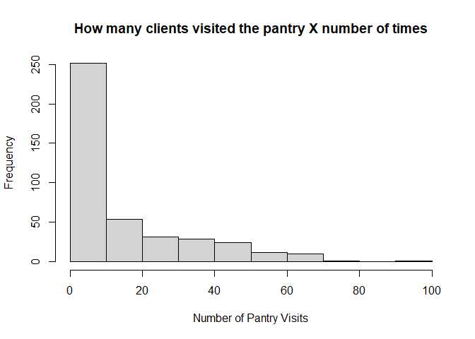
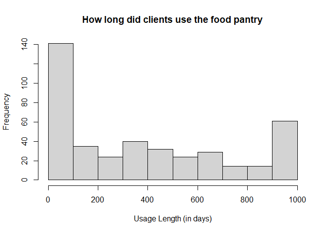
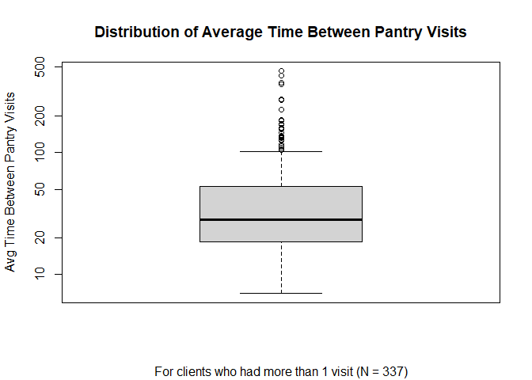

Food Pantry Utilization
=======================

Some Clients Have Multiple Entries Logged for the Same Date
-----------------------------------------------------------

There may be some duplicate records in the food pantry data. However,
it’s possible this data is genuine because a client may have picked up
multiple bags in one visit and it was documented as separate records.

12 clients clients have duplicate records. For reference, there are 414
clients with food pantry data. As an example, anon\_ID 15 looked like it
had two of each of its records.

Regardless, it’s possible the duplicate records don’t really matter if
we focus on the number of visits (distinct dates) and when they ocurred.

How often do clients visit the food pantry?
===========================================

18.6% of clients who visited the food pantry at all only visited once.  
42.27% of clients who visited the food pantry went at least 10 times.

    # creating a table organized by client
    pantry_by_client <- pantry %>%
      group_by(anon_ID) %>%
      summarise(
        num_visits = length(unique(assistance_date)), 
        first_visit = min(assistance_date),
        last_visit = max(assistance_date)
      ) 

    # plot
    hist(pantry_by_client$num_visits,
         xlab = "Number of Pantry Visits",
         main = "How many clients visited the pantry X number of times")

    # % visited more than 10 times
    nrow(pantry_by_client %>% filter(num_visits >= 10))/nrow(pantry_by_client)

    ## [1] 0.4227053

    # % visited only 1 time
    nrow(pantry_by_client %>% filter(num_visits == 1))/nrow(pantry_by_client)

    ## [1] 0.1859903

How long did clients use the food pantry?
=========================================

Histogram of total length of time clients used the food pantry (last
visit - first visit)

Since our data is limited, it’s possible that this is an
underrepresentation of total duration.

    # getting total duration of pantry usage per client
    pantry_by_client <- pantry_by_client %>%
      mutate(usage_length =  as.numeric(difftime(last_visit, first_visit, units = "days")))

    # plot
    hist(pantry_by_client$usage_length,
         main = "How long did clients use the food pantry",
         xlab = "Usage Length (in days)")

Time in Between Pantry visits
-----------------------------

For clients who visited more than once, most of them visited the pantry
within two months of their last visit on average.

I found the length of time since the previous visit for each visit.
Then, grouping by client, I found the average time between visits.

    # creates a table to get avg time b/w visits
    avg_time_between_visits <- unique(pantry) %>% # remove duplicate rows 
      group_by(anon_ID)%>%  
      arrange(anon_ID, assistance_date) %>%
      filter(n() > 1) %>%
      mutate(Difference = difftime(assistance_date, lag(assistance_date), units = "days") )  %>%
      summarize(mean_time = mean(Difference, na.rm=TRUE)) 

    # plot
    boxplot(as.numeric(avg_time_between_visits$mean_time), 
            log = "y",
            main = "Distribution of Average Time Between Pantry Visits",
            ylab = "Avg Time Between Pantry Visits",
            sub = "For clients who had more than 1 visit (N = 337)")

Poverty data
============

68.36% of clients who used the food pantry were in poverty

    length(unique(pantry$anon_ID)) # unique food pantry clients

    ## [1] 414

    pantry <- merge(pantry, client_data, by = "anon_ID", all.x = TRUE)

    pantry_in_poverty = filter(pantry, poverty == "Yes")

    length(unique(pantry_in_poverty$anon_ID)) # 283 food pantry clients in poverty

    ## [1] 283

    283/414

    ## [1] 0.6835749
