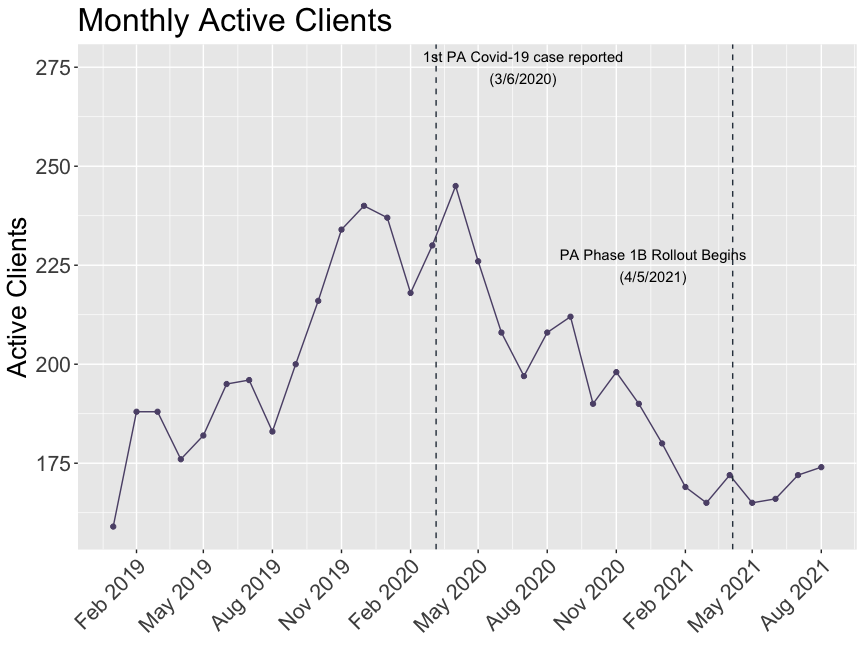
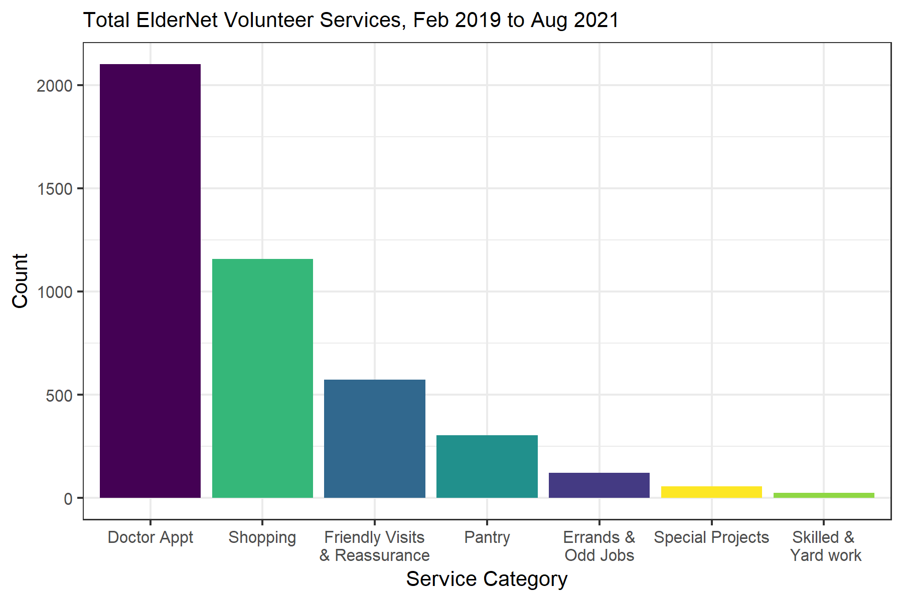
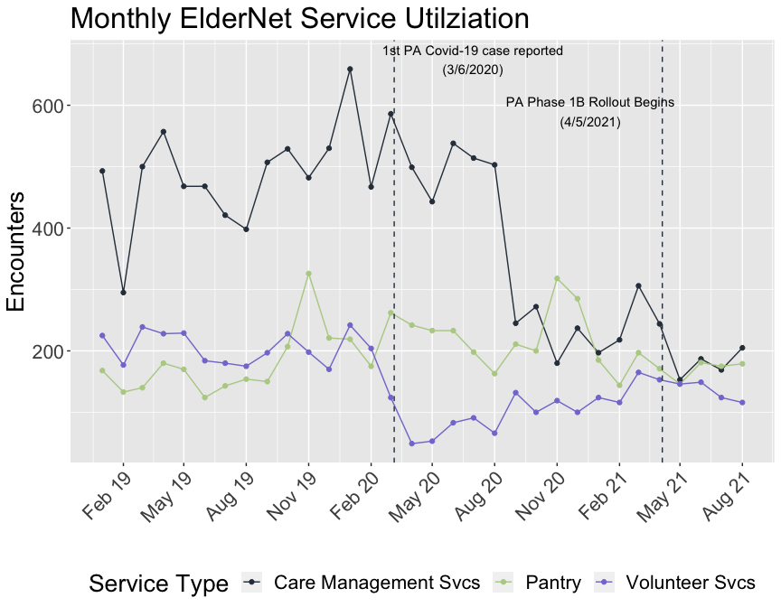
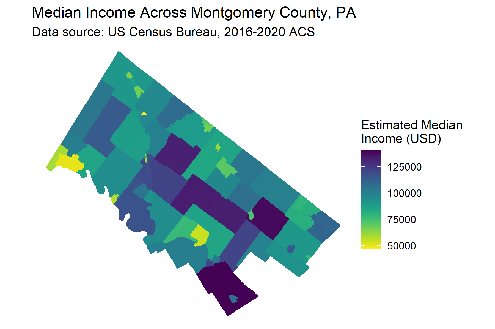
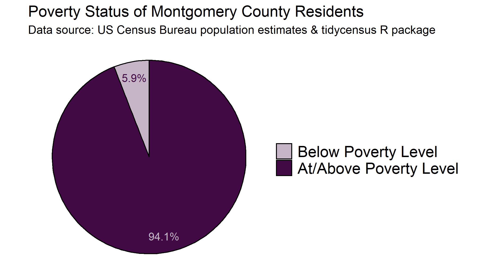
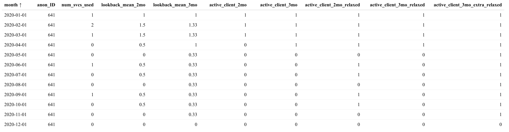

```{r setup, include=FALSE}
knitr::opts_chunk$set(echo = TRUE)
library(tidyverse)
library(kableExtra)
```

## ElderNet's Impact in the Community

### Executive Summary

ElderNet provides a lifeline to elderly and disabled residents of Lower Merion and Narberth Townships in Pennsylvania by connecting them with public services to help them remain independent and in their own homes for longer. This data review confirmed the need for such services by highlighting an potentially overlooked population in poverty in an otherwise high-income area, and documenting the continued use of services to meet basic human needs such as a food pantry and access to medical care. Our analysis demonstrates that ElderNet is doing well to reach a community in need and suggests the utilization of a metric to track client activity and connecting this with client outcomes to better determine the efficacy of offered services in keeping clients in their homes. Such a metric may also help to ensure service accessibility remains unobstructed in times of disruption and uncertainty such as during the COVID-19 pandemic.

### Contributors

 * Troy Bleacher
 * Gabriel Butler
 * Brendan Graham
 * Katarina Gutierrez
 * Kathrine McAulay
 * Georgette Nicolaides
 * Sumner Siebels
 * Carl Thompson

### Problem Definition

[ElderNet of Lower Merion and Narberth](https://eldernetonline.org/) is a nonprofit organization that was founded in 1976 by representatives of community, religious and governmental groups. ElderNet serves adults of all ages, especially frail older or younger disabled persons with low to moderate incomes who reside in Lower Merion or Narberth. ElderNet helps older neighbors remain independent and provides a variety of free, practical services so they have access to healthcare, food security, and an improved quality of life. ElderNet also provides information to individuals who need assistance with housing, nursing care, or other necessities.

The role of Team 1 in this Datathon was to explore the impact of ElderNet services on the community it serves.

### Dataset

Data from ElderNet was deitentified and recoded by the Datathon leads and was provided to the teams as five distinct datasets. Clients were assigned unique identifier to allow comparison and merging across datasets.

* Care Management: A summary of the assistance received by each client and the associated benefit to that client
* Client Info: Basic demographics (County, poverty status, minority status, and a blinded age group assignment)
* Donations: A summary of ElderNet donation information; no client information
* Pantry: A summary of the food provided to each client via the Pantry service
* Volunteer Services: A summary of the rides provided to each client and the purpose of each ride

Some basic data cleaning was required for the Care Management dataset to correct for typos etc. A cleaned version of this dataset can be found [here](https://github.com/brndngrhm/2022_datathon/blob/main/analyses/team1/kathrine_m/cleaned_data_files).

There were a large number of missing values in the assistance and benefit categories within the Care Management dataset. Further, these variables were split into three assistance and three benefit categories, to allow capture of multiple assistance events on a single date. To consolidate this information and minimize NA values, these variables were merged. The merged version of this dataset can be found [here](https://github.com/brndngrhm/2022_datathon/blob/main/analyses/team1/kathrine_m/cleaned_data_files).


### Results

#### How has ElderNet helped remain in their home for longer?

Without outcome data for each client, it was not possible to infer which ElderNet services were associated with successfully allowing clients to remain in their homes. Instead, service usage was reviewed in aggregate to highlight those that were most heavily used.

Between February 2019 and August 2021 there were: 

* 21,504 instances of direct care
* 766 home visits, lasting more than 485 hours
* Over 638 hours of phone calls
* 145,300 lbs of food issued from the Pantry
* 2,102 rides to doctor's appointments

The services offered by ElderNet were returned to time and again by clients, proving not only their utility, but their availability. 119 clients took advantage of services 50 or more times, and 66 used them 100 or more times.
\

The concept of tracking client activity over time was also explored and an *Active Client* was defined as a client who had used at least one service (volunteer services, pantry, or care management) in at least one of the previous two months. This is a lagging indicator and the impact of the COVID-19 pandemic can be seen in 2020, followed by a hopeful uptick in service usage following vaccination roll out in early 2021 (Figure 1). A limitation of this metric is that it does not take into account the intensity of service utilization; however, the inclusion criteria can be modified to narrow or widen the window as desired. See the Appendix for more details about how this metric was created.

{width=350px}

**Figure 1.** ElderNet client activity over a two year period

#### How well is ElderNet connecting participants to the public benefits that they need?

**Health/Medical:** Between April 2015 and December 2021, ElderNet volunteers provided services to clients 4,100 times, and the largest
share of these (2,102, 51%) were transportation to doctors appointments (Figure 2). 

{width=400px}

**Figure 2.** Needs met via ElderNet volunteer services, including transportation and home visits
\

**Food Assistance:** The second largest share of volunteer services went to shopping, impacting 76 clients a total of 1158 times. Further, the Pantry service has issued 145,000 lbs of food to clients since 2019, with peaks seen around the winter holidays, when ElderNet issues holiday baskets and also in the early months of the COVID-19 pandemic in 2020 (Figure 3, green line). It is not surprising that the pandemic impacted ElderNet services, with both Care Management and Volunteer Services seeing a decline in early 2020 (Figure 3). This can be explained in part by the lack of availability of public services such as doctors appointments. However, the apparent increase of Pantry usage during this time highlights the value of this service in the community in times of need.
\

{width=350px}

**Figure 3.** Utilization of ElderNet Care Management (black), Pantry (green), and Volunteer (purple) services between February 2019 and August 2021
\

#### How do the counties served by ElderNet compare to similar counties where services like ElderNet are not available?

With Team 3 taking a deep dive into geography in the context of service expansion, Team 1 opted to limit analysis to Montgomery County, PA. ElderNet currently serves two Townships within the County: Lower Merion and Narberth. Only 6% of the 805,000 Montgomery County residents fall below the federal poverty level and the median income in Lower Merion is $140,000; this is the highest in the County (2016-2020 American Community Survey, US Census Bureau (Figure 4). Nonetheless, 490 people in this region required assistance associated with basic human needs such as food and accessing healthcare in the last two years. It is clear that if such a need exists in these Townships there is likely a similar or more pronounced need in neighboring Townships.
\

A             |  B
:-------------------------:|:-------------------------:
{width=250px}  |  {width=250px}

**Figure 4.** Proportion of residents below the federal poverty level in Montgomery County, PA (A) and the estimated median household income across the county (B). Lower Merion and Narberth are highlighed in the red box.

### Conclusions

* Based on typical usage, transportation, especially to doctor’s appointments, is an extremely desired service  
* Access to the food pantry was a consistent and well used service  
* The pandemic impacted monthly active clients, but active clients began to rise following vaccine roll out  
* Linking this information to the current in-home status of clients would allow provide more insight into the effectiveness of these services  

### Remaining Questions

* What services were most likely to enable a client to stay in their home? 
* Did client COVID-19 vaccination status impact ridership or other services?
* Was the drop in ridership during early pandemic due to reduced demand, or reduced availability of drivers?
* Did the rise in telemedicine impact need for rides to doctor’s appointments, that is, what percentage of rides could be eliminated if patients were able to access telemedicine?

### References

2016-2020 5 year American Community Survey, US Census Bureau

Census data was obtained and analyzed using the `tidycensus` R package, using resources from Kyle Walker: https://walker-data.com/tidycensus/

This data can also be accessed in a user-friendly API at https://data.census.gov/cedsci/

### Appendix

#### Active Client Details

Not every client has an interaction with *each* service *each* month. For example, a client may use volunteer services in January, then 2 months later visit the pantry leaving a gap in their utilization. To get a "tidy" dataset where we have 1 row per client per month, we created a 'master calendar' for each client, starting from the first date in the data set and ending at the last date. Then we adjust this for the date of each client's first interaction. Prepping the data this way will allow us to join the care management, pantry and volunteer data to the client data for each client for each month, which will preserve instances where a client had 0 interactions in a given month.

Once the data is prepped we can define a process to categorize a client as active or not. The process is as follows:
  
   * for each client for each month, calculate the number of ElderNet services they engaged with. This number will range from a minimum of 0 if they didn't use any services, to a maximum of 3 if a client used the pantry, volunteer services and care mgmt services in that month.
   * calculate a 2 month rolling mean of services each client engaged with
   * check if that rolling mean is greater than or equal to 0.5, and if so define that client as being active in that month
   * add up all active clients for each month

Both the rolling mean period and threshold can be adjusted to either widen or narrow the definition of an active client. To make the definition more strict, the threshold could be changed to from 0.5 to 1, which would mean the client would need to use least 1 service offered in 2 of the 2 previous months. To make the definition more relaxed, the rolling mean period could be extended to 3 months and the threshold could be changed to 0.33, which would mean the client would need to use least 1 service offered in 1 of the 3 previous months to be considered active.

The table below shows how a single client can fall into or out of Active Client status depending on the rolling mean period and threshold used. the `lookback_mean_` columns contain 2 and 3 month rolling means of services used, respectively. The remaining `acitve_client` columns compare the rolling means to various thresholds

```{r, echo=FALSE, message=FALSE}
definition_table <- read_csv("kathrine_m/active_client_def_table.csv")
kbl(definition_table, booktabs = T) %>% 
  column_spec(1, width = "2.25in") %>% 
  column_spec(2, width = "1in") %>%
  column_spec(3, width = "0.75in") %>%
  column_spec(4, width = "2.5in")
```

\
\
An example (client number 641):



